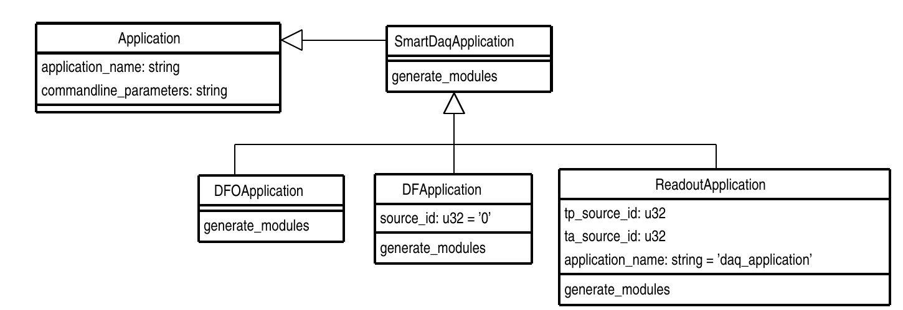
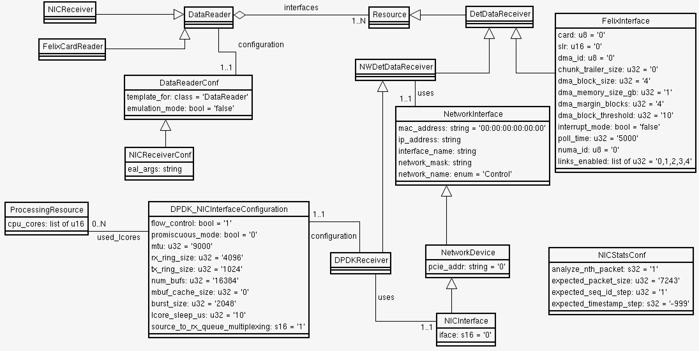
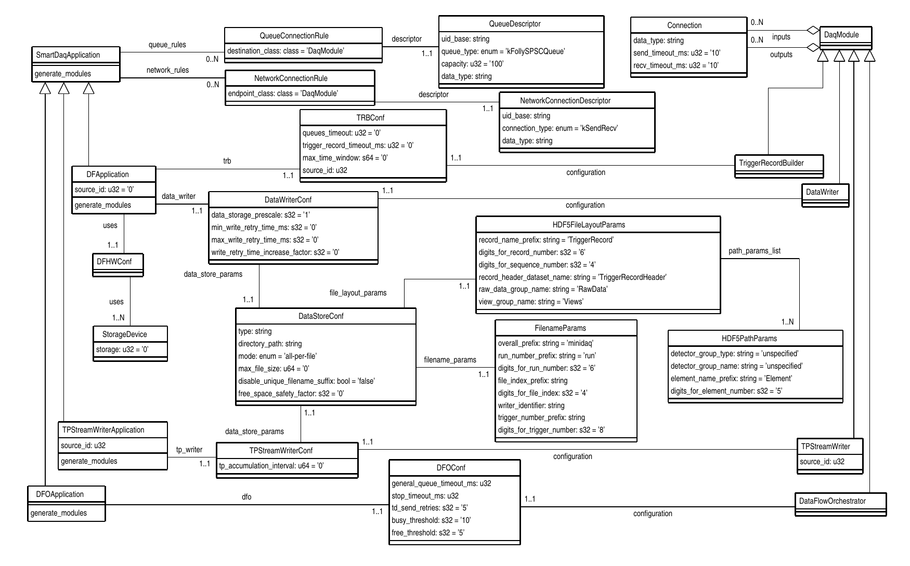
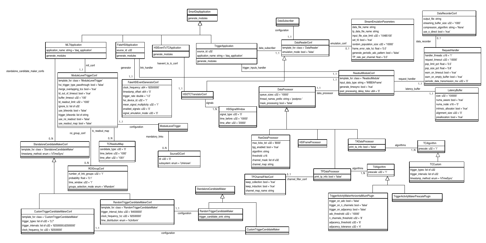
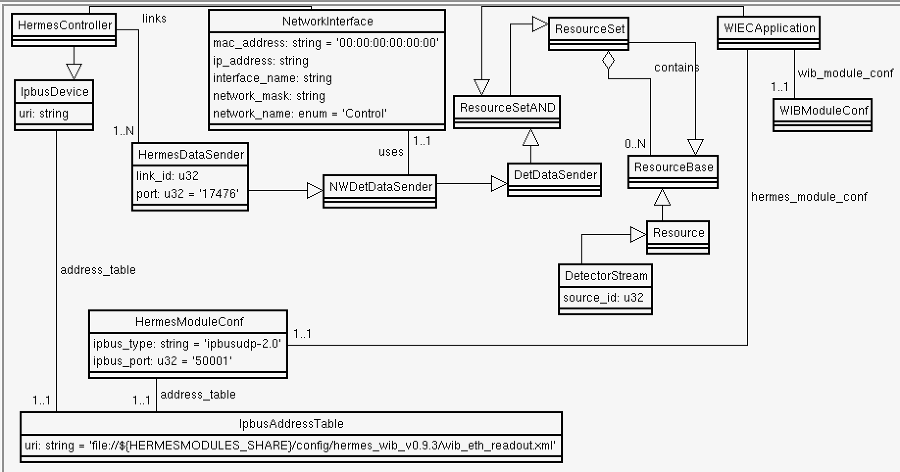

# Appmodel 

 This package extends the schema from the confmodel package
to describe readout, dataflow and trigger  applications.

## SmartDaqApplication

 **SmartDaqApplication** is an abstract class that has no direct
relationships with **DaqModules**. The **DaqModules** themselves must
be generated on the fly by an implementation of the
`generate_modules()` method. The **SmartDaqApplication** has
relationships to **QueueConnectionRules** and

**NetworkConnectionRules** to alow the `generate_modules()` method to
know how to connect the modules internally and to network endpoints.

*NB:* The declaration of the `generate_modules()` method must be
 repeated in each subclass and an implementation provided. The
 declaration in **SmartDaqApplication** is not pure virtual but its
 implemetation calls the generate_modules() implementation of the
 specific subclass using a 'magic' map of class names to generate functions.

Readout, HSI, Hermes andDataflow and Trigger applications extend from **SmartDaqApplication**
## ReadoutApplication

 

 The **ReadoutApplication** inherits from both **SmartDaqApplication**
and **ResourceSetAND**. This means it has a contains relationship that
can contain any class inheriting from **ResourceBase** but should only
contain **DetectorToDaqConnection**s. The `generate_modules()` method will
generate a **DataReaderModule** for each **DetectorToDaqConnection** associated with the application, and set of **DataHandlerModule** objects, i.e. **DLH** for each

**DetectorStream** plus a single **TPHandlerModule** (FIXME: this shall become a TPHandler per detector plane). Optionally **DataRecorderModule** modules may be created (not supported yet)). The modules are created
according to the configuration given by the data_reader, link_handler, data_recorder
and tp_handler relationships respectively. Connections between pairs
of modules are configured according to the queue_rules relationship
inherited from **SmartDaqApplication**.

### Far Detector schema extensions

Several OKS classes have far detector specific customisations, as shown in the diagram.

## DataFlow applications

  

The Datflow applications, which are also **SmartDaqApplication** which
generate **DaqModules** on the fly, are also included here.

## Trigger applications

  

The Trigger applications, which are also **SmartDaqApplication** which
generate **DaqModules** on the fly, are also included here.

## WIEC application

  

The WIEC application is a **SmartDaqApplication** which generates **HermesModule** modules , and in future WIB modules, on the fly.
It extends from **ResourceSetAND** and contains **DetectorToDaqConnection**s, which each contains a **DetDataReceiver** and **DetDataSender**s containing **DetectorSrteam**s.

## Testing SmartDaqApplication module generation

This package also provides a program `generate_modules_test` for
testing the generate_modules method of SmartDaqApplications. It reads
a configuration from an OKS database, generates the DaqModules for the
requested SmartDaqApplication and prints a summary of the DaqModules
and Connections.

-----

_Last git commit to the markdown source of this page:_

_Author: John Christian Freeman_

_Date: Thu Oct 17 17:46:05 2024 +0200_

_If you see a problem with the documentation on this page, please file an Issue at [https://github.com/DUNE-DAQ/appmodel/issues](https://github.com/DUNE-DAQ/appmodel/issues)_

