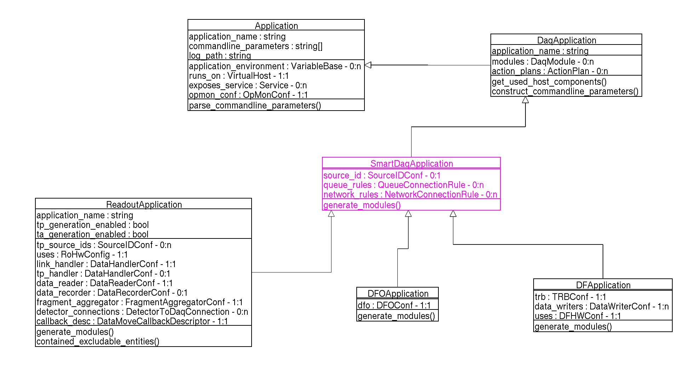
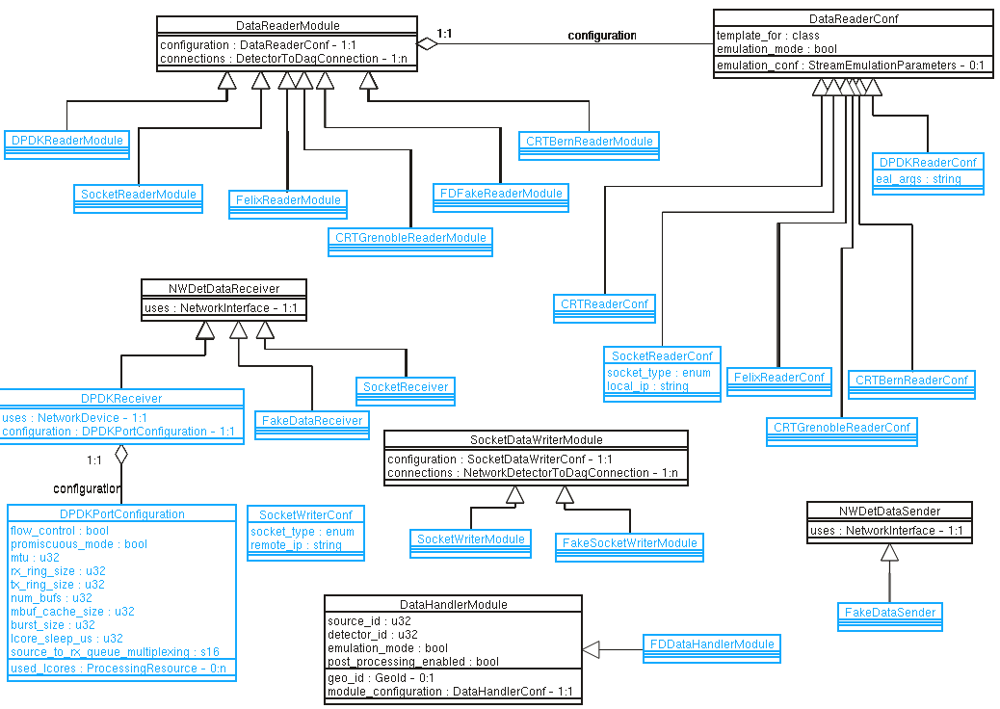
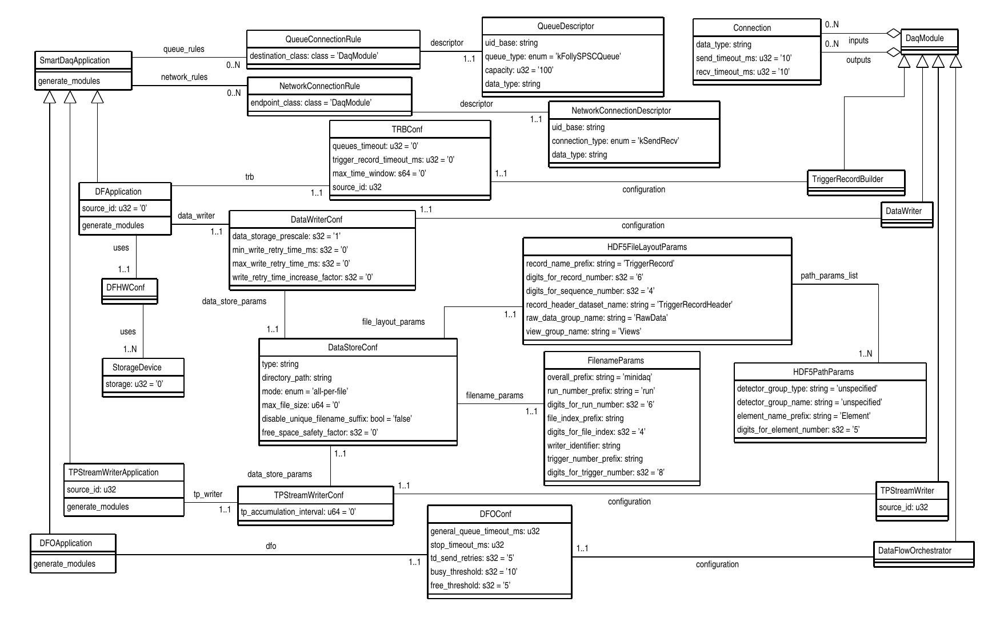
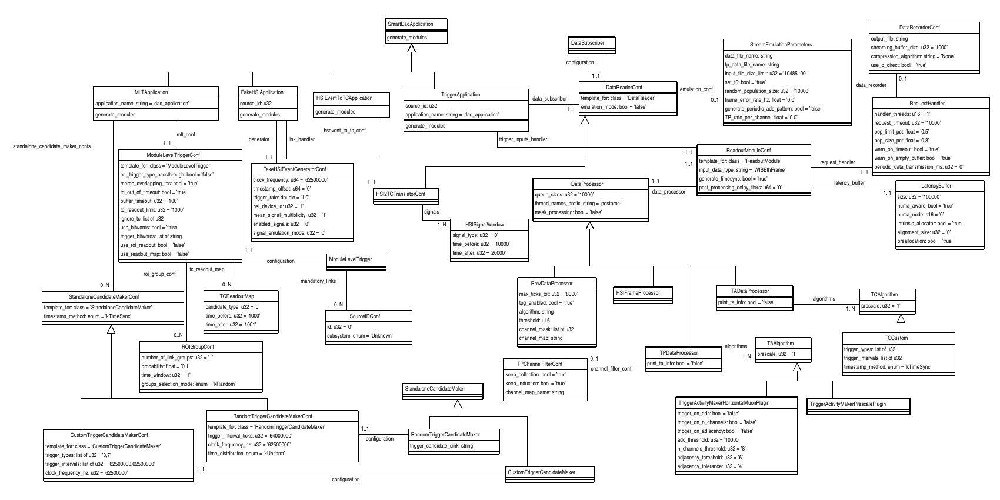
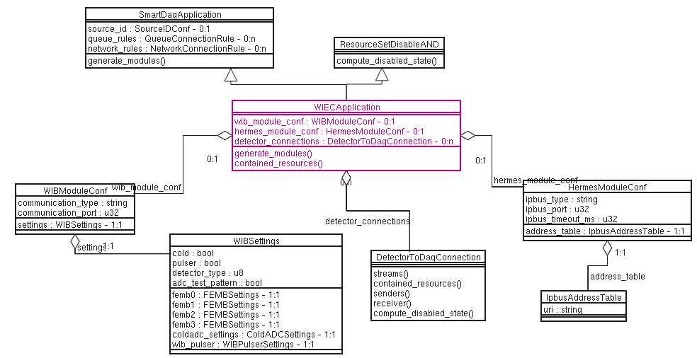

# Appmodel 

 This package extends the schema from the confmodel package
to describe readout, dataflow and trigger  applications.

## SmartDaqApplication

 **SmartDaqApplication** is an abstract class where the modules
relationship will normally be left empty with the **DaqModules** themselves
being generated on the fly by an implementation of the
`generate_modules()` method. The **SmartDaqApplication** has
relationships to **QueueConnectionRules** and

**NetworkConnectionRules** to allow the `generate_modules()` method to
know how to connect the modules internally and to network endpoints.

The `generate_modules` method is a pure virtual function that must be implemented for each **SmartDaqApplication**. It should populate the modules relationship of the **DaqApplication** and call `conffwk::update()` so that subsequent calls to `get_modules` will return the newly created objects.

Readout, HSI, Hermes Dataflow and Trigger applications extend from **SmartDaqApplication**

## ReadoutApplication

 

 The **ReadoutApplication** inherits from **SmartDaqApplication** and provides
a `generate_modules()` method which will
generate a **DataReaderModule** for each **DetectorToDaqConnection** associated with the application via the `detector_connections` relationship, and set of **DataHandlerModule** objects, i.e. **DLH** for each

**DetectorStream** plus a single **TPHandlerModule** (FIXME: this shall become a TPHandler per detector plane).

 Optionally **DataRecorderModule** modules may be created (not supported yet)). The modules are created
according to the configuration given by the data_reader, link_handler, data_recorder
and tp_handler relationships respectively.

 Connections between pairs
of modules are configured according to the `queue_rules` relationship
inherited from **SmartDaqApplication**.

### Far Detector schema extensions

Several OKS classes have far detector specific customisations, as shown in blue the above diagram.

## DataFlow applications

  

The Datflow applications, which are also **SmartDaqApplication** which
generate **DaqModules** on the fly, are also included here.

## Trigger applications

  

The Trigger applications, which are also **SmartDaqApplication** which
generate **DaqModules** on the fly, are also included here.

## WIEC application

  

The WIEC application is a **SmartDaqApplication** which generates **HermesModule** modules , and **WIBModules**, on the fly.

## Testing SmartDaqApplication module generation

This package also provides a program `generate_modules_test` for
testing the `generate_modules` method of **SmartDaqApplication**s. It reads
a configuration from an OKS database, generates the DaqModules for the
requested SmartDaqApplication and prints a summary of the DaqModules
and Connections.

-----

_Last git commit to the markdown source of this page:_

_Author: Gordon Crone_

_Date: Thu Sep 4 16:44:30 2025 +0100_

_If you see a problem with the documentation on this page, please file an Issue at [https://github.com/DUNE-DAQ/appmodel/issues](https://github.com/DUNE-DAQ/appmodel/issues)_

