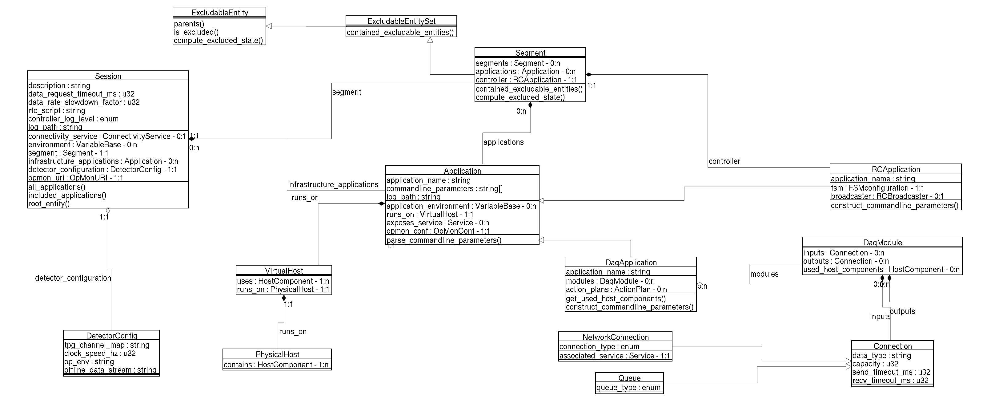
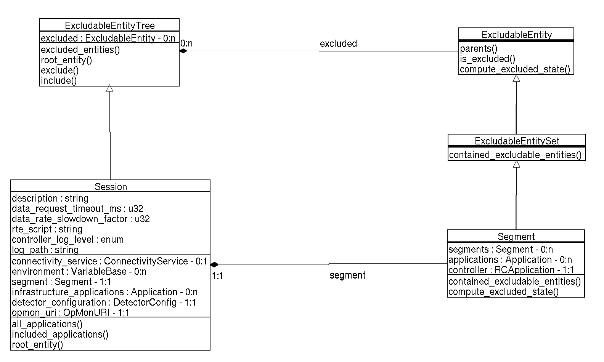
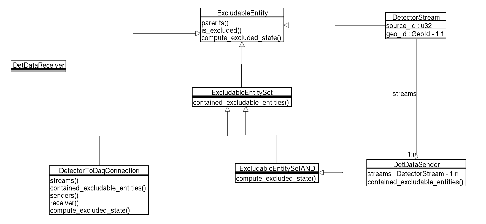
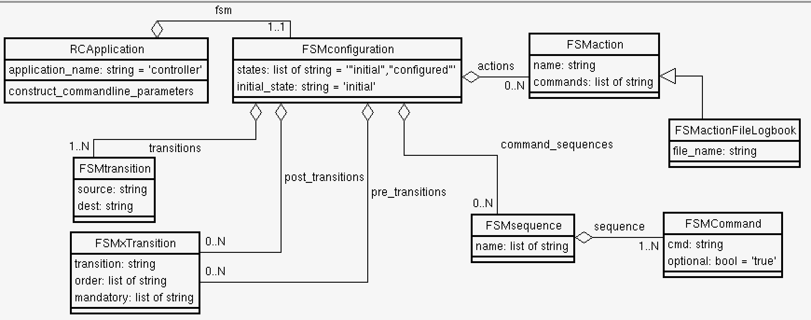

# confmodel
This package contains the core' schema for the DUNE daq OKS configuration.

The top level of the schema is the **Session** which defines some global
DAQ parameters and has a relationship to a single top-level **Segment**.
It also has a list of excluded [ExcludableEntitys](#resources-and-resourcesets). It is intended that parts of
the DAQ system that are not required in the current run are simply
excluded rather than deleted from the database altogether.

A **Segment** is a logical grouping of applications which
are controlled by a single controller (**RCApplication**). A **Segment** may contain other
nested **Segment**s. A **Segment** is a ExcludableEntity that can be included/excluded [(see below)](#resources-and-resourcesets),
excluding a **Segment** excludes all of its nested **Segment**s.

The **Application** class has attributes defining the application's
 `application_name` (executable name) and `commandline_parameters`. Its
 `application_environment` relationship lists environment variables needed by the
 application in addition to those defined by the **Session**.

## ExcludableEntities

**ExcludableEntity** is an abstract class describing an item that can be
excluded directly. It has the method `is_excluded(const dunedaq::confmodel::ExcludableEntityTree& session)` which can be called
by application code to determine if the object should be considered
excluded for this session (Session is a subclass of ExcludableEntityTree). The [exclusion logic](#the-resource-excluded-logic) calls the virtual
`compute_excluded_state(const std::set<std::string>& excluded_resources)` method to determine the state of the ExcludableEntity, the excluded_resources argument is a list of UIDs of all the ExcludableEntities that have been excluded so far. The
implementation provided by the base class just checks that the object
itself is not in the list of excluded objects. Derived classes can
re-implement this method with whatever logic is needed to determine the
state of the object, for example the **ExcludableEntitySetAND** class
provides an implementation that ANDs together the state of all of its
contained objects. 

**ExcludableEntitySet** is an abstract container of **ExcludableEntity**s which can be excluded together. It
is itself a ExcludableEntity (so can be nested). It defines a pure virtual method `contained_excludable_entities()` which returns a vector of pointers to 'contained' resources. Developers should implement this method to extract any resources that need to be considered for determining the excluded state of the set from among the class's relationships. The class may have relationships to other ExcludableEntity derived
objects that will be ignored for the excluded check.

**ExcludableEntitySetAND** is a container of **ExcludableEntity**s which will
be excluded if *all* of its **ExcludableEntity**s are excluded. It provides a
final implementation of the ExcludableEntitySet::compute_excluded_state() method.

**ExcludableEntitySetOR** is a container of **ExcludableEntity**s which
provides a final implementation of the ExcludableEntitySet::compute_excluded_state()
method returning true if *any* of its contained **ExcludableEntity**s are
excluded.

**Segment** is a container of **Segment**s and **Applications**
which inherits from **ExcludableEntitySetAND** so it can be excluded
directly or indirectly if all its components are excluded.
 
 

### The ExcludableEntity excluded logic

The ExcludableEntity excluded logic works on a single tree of **ExcludableEntitySets**.
It is held by the virtual class **ExcludableEntityTree** currently **Session**
is the only concrete class derived from it. 
The **ExcludableEntityTree** holds a **ExcludedExcludableEntitys** object which is initialised with a reference to the root **Segment**
and the list of excluded resources from its `excluded` relationship.

⚠️**Any ExcludableEntitySet that is not referenced by a ExcludableEntitySet in the tree
starting at the Session's segment relationship will not be considered
by the exclusion logic!**

The **ExcludedExcludableEntitys** constructor will configure itself using the
tree of ExcludableEntitys and initial list of excluded ExcludableEntitys.
To start with, the UID of each member of the list is inserted into a
set and any 'contained' (using the `contained_excludable_entities()` method) ExcludableEntitys
are also excluded.

A list of all ExcludableEntitySets in the tree is generated by recursively
calling `contained_excludable_entities()` and iterating over all the ExcludableEntitySets.
Then it iterates over the list of **ExcludableEntitySet**s. If a ExcludableEntitySet
is not currently in the excluded set, it will call the `compute_excluded_state()`
method to see if its state has been changed by the current content of
the excluded set. It will repeat this procedure until an iteration
that ends with the same number of excluded resources it started with.

## Readout Map

 

(the blue classes in the diagram are not part of confmodel and are
there to show how the other parts fit together)

The readout map is defined in terms of **DetectorStream** objects
which define a one to one mapping between a source_id and a

 **GeoID" object. A collection of streams are
aggregated into a **DetDataSender** and a group of **DetDataSender**
objects are contained in a **DetectorToDaqConnection** along with a
single **DetDataReceiver**.

### ExcludableEntity handling in the readout map

The **DetectorToDaqConnection** is a **ExcludableEntitySet** with a custom implementation of `compute_excluded_state()` that checks that the **DetDataReceiver** and at least one **DetDataSender** are included.

The **DetDataSender** is a **ExcludableEntitySetAND** that contains a set of **DetectorStream** **ExcludableEntity**s.

## Finite State Machines
Each controller (**RCApplication**) uses one **FSMConfiguration** object that describes action, transitions and sequences.

 

## Notes

### VirtualHost

 The idea is that this describes the subset of resources of a physical
host server that are available to an Application. For example two
applications may be assigned to the same physical server but each be
allocated resources of a different NUMA node.

### **DaqApplication** and **DaqModule**

 The **DaqApplication** contains a list of **DaqModule**s each of which has a
list of used resources. The **DaqApplication** provides a method
`get_used_host_components` which can be called by `appfwk` in order to check
that these resources are indeed associated with the VirtualHost by
comparing with those listed in its `hw_resources` relationship.

### NetworkConnection
  Describes the connection type and points to the **Service** running over this connection.

-----

_Last git commit to the markdown source of this page:_

_Author: Marco Roda_

_Date: Fri Aug 28 15:48:40 2026 +0100_

_If you see a problem with the documentation on this page, please file an Issue at [https://github.com/DUNE-DAQ/confmodel/issues](https://github.com/DUNE-DAQ/confmodel/issues)_

