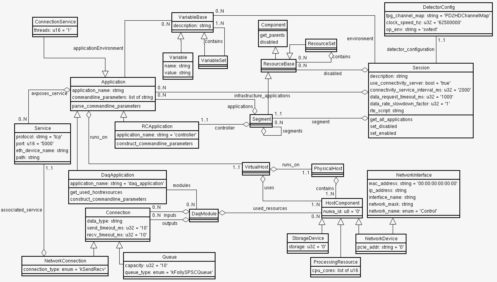
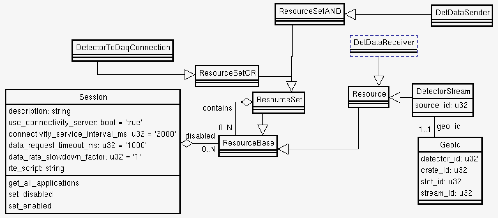
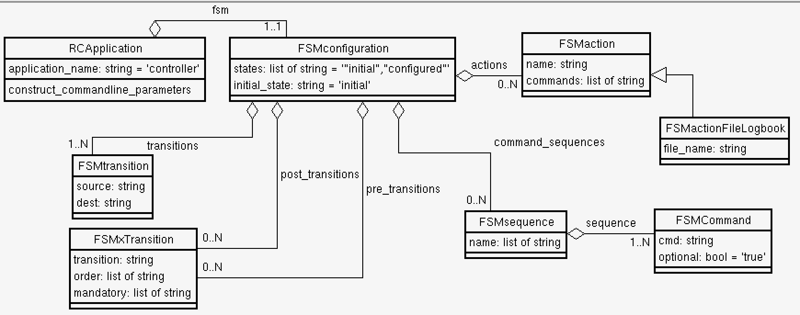

# confmodel
This package contains the 'core' schema for the DUNE daq OKS configuration.

  

The top level of the schema is the **Session** which defines some global
DAQ parameters and has a relationship to a single top-level **Segment**.
It also has a list of disabled Resources. It is intended that parts of
the DAQ system that are not required in the current run are simply
disabled rather than deleted from the database altogether.

A **Segment** is a logical grouping of applications and resources which
are controlled by a single controller. A **Segment** may contain other
nested **Segment**s. A **Segment** is a Resource that can be enabled/disabled,
disabling a **Segment** disables all of its nested **Segment**s.

The **Application** class has attibutes defining the application's
 `application_name` (executable name) and `commandline_parameters`. Its
 `applicationEnvironment` relationship lists environment variables needed by the
 application in addition to those defined by the **Session**. An
 [example Python script](https://github.com/DUNE-DAQ/confmodel/blob/develop/scripts/app_environment.py)
 that prints out the environment for enabled applications in the

 **Session** is provided in the `scripts` directory.

## Readout Map

 

The detector to DAQ connections are described using different types of **Resources**. Each **DetectorToDaqConnection** contains one **ResourceSetAND** containing one or more **DetDataSender**s and one **DetDataReceiver**. The **DetectorToDaqConnection** is a **ResourceSetOR**, meaning that if either the receiver or all the senders are disabled, then also the connection is disabled. 

Each **DetDataSender** contains a set of **DetectorStream**s, which consist of a **Resource** associated to one **GeoId**.

## Finite State Machines
Each controller (**RCApplication**) uses one **FSMConfiguration** object that describes action, trasnisions and sequences.

 

## Notes

### VirtualHost

 The idea is that this decribes the subset of resources of a physical
host server that are available to an Application. For example two
applications may be assigned to the same physical server but each be
allocated resources of a different NUMA node.

### **DaqApplication** and **DaqModule**

 The **DaqApplication** contains a list of **DaqModule**s each of which has a
list of used resources. The **DaqApplication** provides a method
`get_used_hostresources` which can be called by `appfwk` in order to check
that these resources are indeed associated with the VirtualHost by
comparing with those listed in its `hw_resources` relationship.

### NetworkConnection
  Describes the connection type and points to the **Service** running over this connection.

-----

_Last git commit to the markdown source of this page:_

_Author: Giovanna Lehmann Miotto_

_Date: Tue Jun 11 16:35:15 2024 +0200_

_If you see a problem with the documentation on this page, please file an Issue at [https://github.com/DUNE-DAQ/confmodel/issues](https://github.com/DUNE-DAQ/confmodel/issues)_

