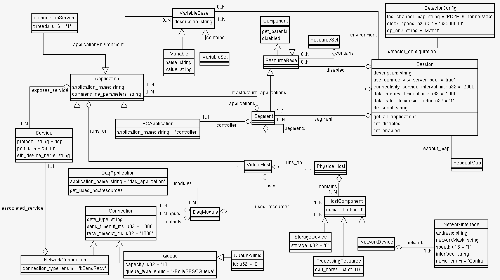
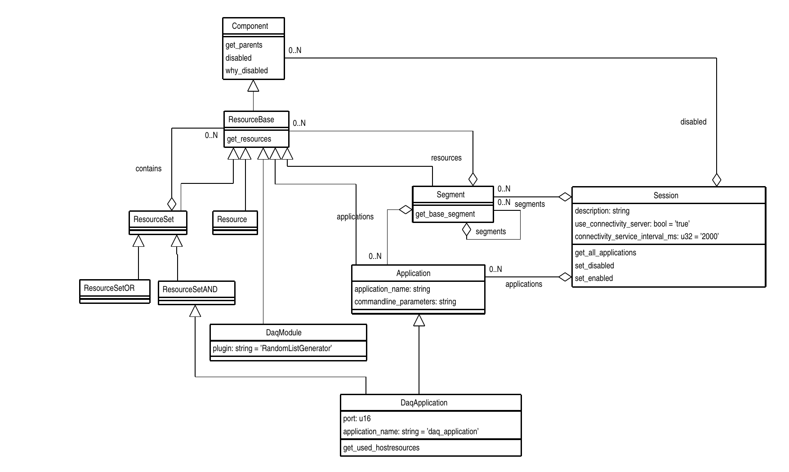
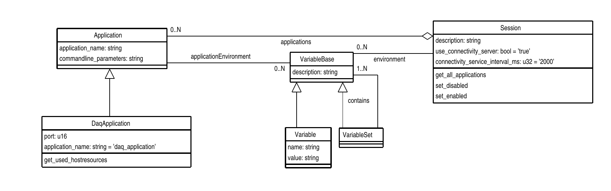

# coredal
This package contains a putative 'core' schema for dunedaq OKS configuration.

  

This version now has the Resource suite of classes borrowed from the
ATLAS core schema. As a first example of using these, the Application
and DaqModule classes now inherit from ResourceBase so all
applications and individual DAQModules can be disabled by adding them
to the `disabled` relationship of the Session.

  

There is a new simple application `list_apps` to list the applications
and their modules, indicating their disabled state where set.

  

The Application class has attibutes defining the application's
 `application_name` (executable name) and `commandline_parameters`. It's
 `applicationEnvironment` relationship lists environment variables needed by the
 application in addition to those defined by the Session. An
 [example Python script](https://github.com/DUNE-DAQ/coredal/blob/develop/scripts/app_environment.py)
 that prints out the environment for enabled applications in the
 Session is provided in the `scripts` directory.

## Notes

### VirtualHost

 The idea is that this decribes the subset of resources of a physical
host server that are available to an Application. For example two
applications may be assigned to the same physical server but each be
allocated resources of a different NUMA node.

### DaqApplication and DaqModule

 The DaqApplication contains a list of DaqModules each of which has a
list of used resources. The DaqApplication provides a method
`get_used_hostresources` which can be called by `appfwk` in order to check
that these resources are indeed associated with the VirtualHost by
comparing with those listed in its `hw_resources` relationship.

### NetworkConnection

  Contains a `uri` attribute for compatability with existing `moo`
  schema. Hope that `protocol` and `port` can be used to construct a
  uri with an address derived from the `Host`'s `NetworkInterface`s.

-----

_Last git commit to the markdown source of this page:_

_Author: John Freeman_

_Date: Thu Jun 8 11:31:44 2023 -0500_

_If you see a problem with the documentation on this page, please file an Issue at [https://github.com/DUNE-DAQ/coredal/issues](https://github.com/DUNE-DAQ/coredal/issues)_

