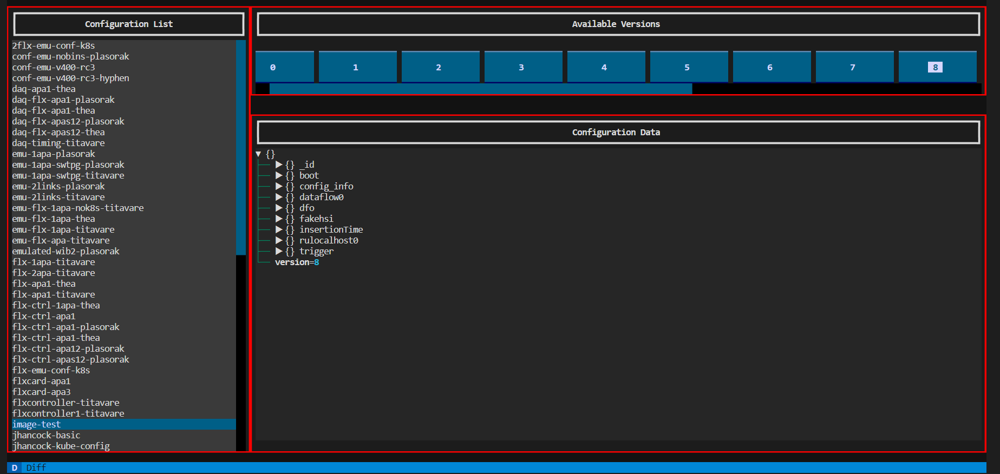
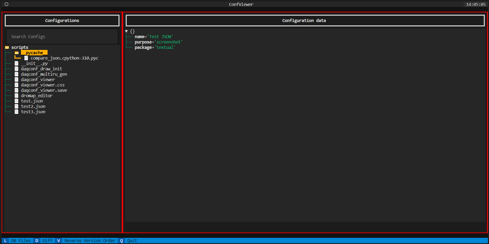
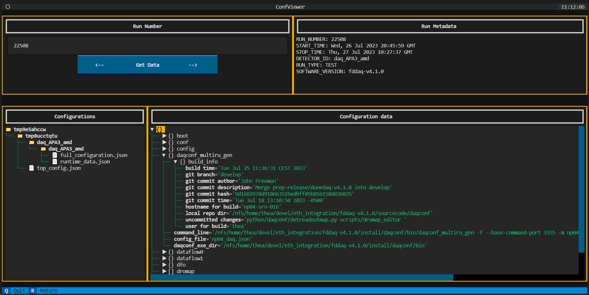

# Interacting with the Configuration Database

## Uploading a config
To use configuration files with a _nanorc_ instance run on Kubernetes, the config first needs to be uploaded to the MongoDB running in the cluster.
To do this, simply run `upload-conf <the_conf_dir/> <name-for-the-conf>`.

_nanorc_ should then be started with `nanorc --pm k8s://np04-srv-015:31000 db://name-for-the-conf partition-name`

Keep in mind that the config directory can contain underscores, but the name it will be given in the database cannot (hyphens are fine).

## Viewing configurations
To inspect the contents of the database, run `daqconf_viewer` after setting up the software environment. This will open a graphical UI in the terminal. There are five optional arguments that can be provided:

* --conf-host and reg-host to manually enter the host of the microservices (defaults to http://np04-srv-023 and http://dunedaq-microservices.cern.ch)

* --conf-port and reg-port to manually enter the port that the service listens on (defaults to 31011 and 5005)

* --dir to tell the config viewer where to look for local config files (defaults to ./)

A list of all configuration names is shown on the left. It can be filtered using the search bar above it. 
Clicking one of these names will generate a list of buttons at the top, corresponding to the saved versions of the config.
The versions are displayed in descending order by default, but this can be changed with the V key.
Click one of the buttons to bring up the config file in the display box. By clicking the arrows, the contents of each sub-schema can be expanded.

Additionally, you can press the L key to switch between viewing the database and viewing local files. The config list will be replaced with a tree representing the contents of the directory given with --dir.

Pressing the D key after picking a config will take you to a very similar screen, albeit with green lines instead of red. 
If a second config is selected using the previously defined process, then a "diff" of the two will be generated, showing all the 
differences between the two in a format similar to how commits are displayed on github.
Again, the L key can be used to switch to local files, allowing for comparisons of local and DB configs in any combination.
Finally, once you are done press q to quit (or use ctrl+c).

## Interacting with the run registry
Pressing the R key while on the first screen will take you to the run registry screen. Metadata for the chosen run is shown in the top right, and the associated config files are displayed in a tree on the bottom left. Selecting one brings up the JSON on the bottom right, with expandable schema as before.

When the application is initialised, the most recent run is shown by default. To navigate to different runs, simply click the back/forward buttons, or type the desired run into the input box and click the Get Data button. The R key can be used to return to browsing the MongoDB when you are done.

-----

_Last git commit to the markdown source of this page:_

_Author: Jonathan Hancock_

_Date: Thu Jul 27 11:15:48 2023 +0200_

_If you see a problem with the documentation on this page, please file an Issue at [https://github.com/DUNE-DAQ/daqconf/issues](https://github.com/DUNE-DAQ/daqconf/issues)_

