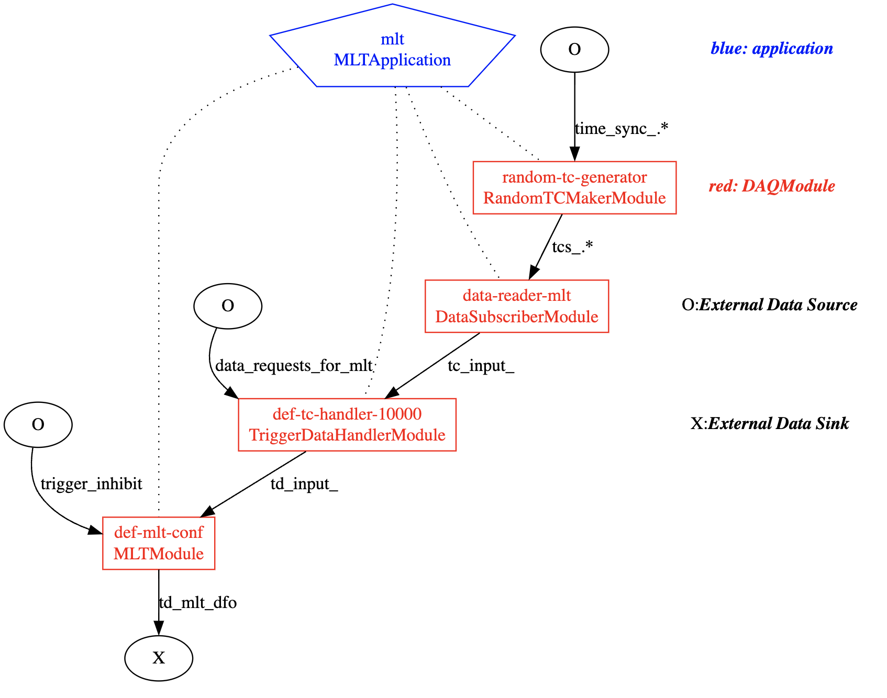

# Creating A Diagram of Your Configuration

## Usage

In `daqconf` it's possible to create a diagram of a DAQ configuration in the [DOT graph description language](https://en.wikipedia.org/wiki/DOT_(graph_description_language)), which can then be fed to the `dot` program to generate a viewable graphic. This is accomplished using the `create_config_plot` application. You can run `create_config_plot -h` to see how it's used, but to explain it simply, you provide it with a database file, the name of a session in that database, and then the name of an object associated with the session. It will create a plot using that object as the root of the plot. Note the object either needs to be the session itself, or a segment or an application in it. E.g., with the `daqsystemtest` repo you can generate a plot of the `mlt` application in its `ehn1-local-2x3-config` test DAQ session via:
```
create_config_plot -f config/daqsystemtest/example-configs.data.xml -s ehn1-local-2x3-config -r mlt
```
and if you want to plot the entire session, you can run
```
create_config_plot -f config/daqsystemtest/example-configs.data.xml -s ehn1-local-2x3-config -r ehn1-local-2x3-config
```
or a shorthand version of that command is
```
create_config_plot -f config/daqsystemtest/example-configs.data.xml -s ehn1-local-2x3-config
```
...where if no root object is specified the default is for `create_config_plot` to take the session passed to `-s` and use it as the root object. Also note that in the event that there's a single session in the database, the `-s <session-name>` argument isn't required. Any of the above commands will create (or clobber) a file called `config.dot`. If you wish to give the file a different name you can use the `-o` option, e.g., `-o mypreferredname.dot`.  Once you have the DOT file, you can generate a graphic by doing the following:
```
dot -Tsvg -o mypreferredname.svg config.dot
``` 
...which can then be displayed, e.g., in a browser window via the link `file:///path/to/file/mypreferredname.svg`.

Note that while `dot` is available on the np04 cluster's system, it's not necessarily available on other hosts. If you're on another host, you may need to execute `spack load graphviz` in your work area to get the `dot` executable. Note that in this scenario that after you're done using `dot` if you wish to develop code you'll want to `spack unload graphviz`; more generally, your build environment isn't guaranteed to continue working after you run `spack load <package>`.

## Examples




-----

<font size="1">
_Last git commit to the markdown source of this page:_


_Author: John Freeman_

_Date: Thu Oct 24 09:20:54 2024 -0500_

_If you see a problem with the documentation on this page, please file an Issue at [https://github.com/DUNE-DAQ/daqconf/issues](https://github.com/DUNE-DAQ/daqconf/issues)_
</font>
