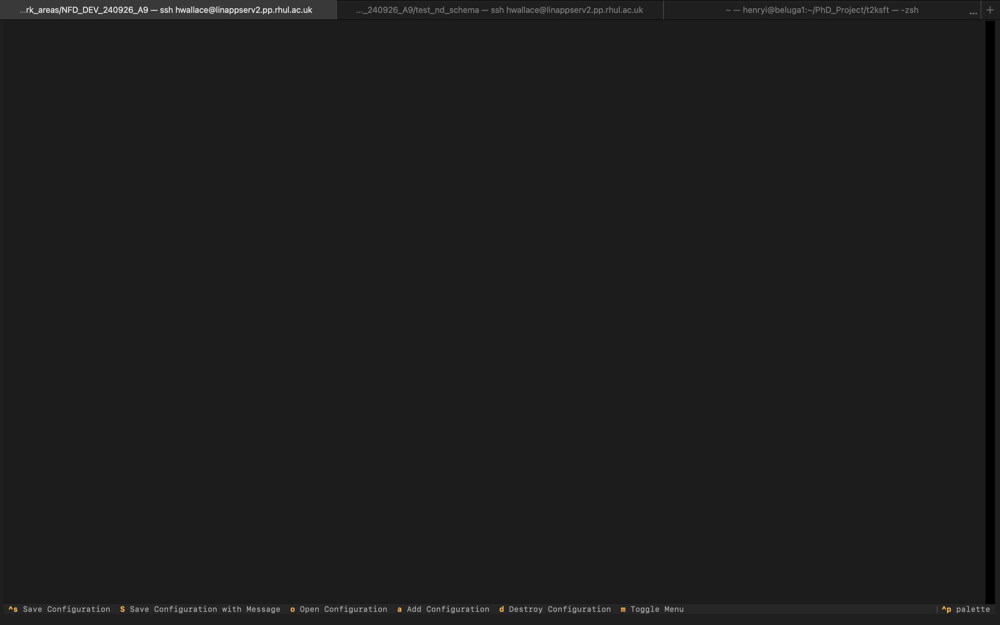
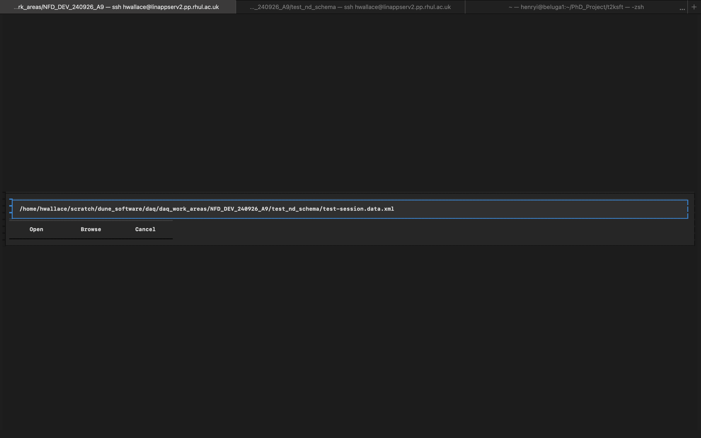
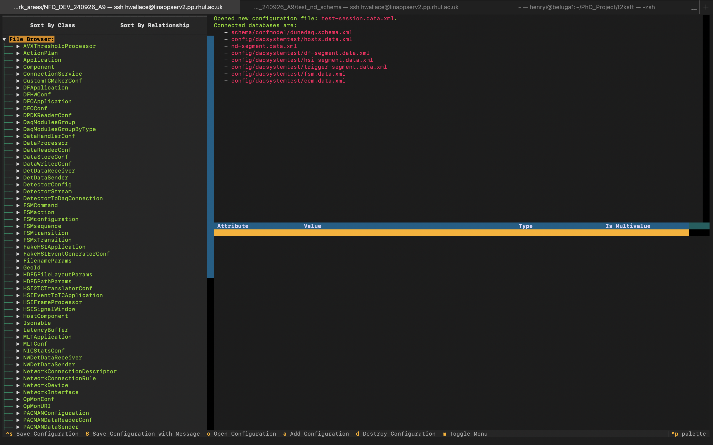
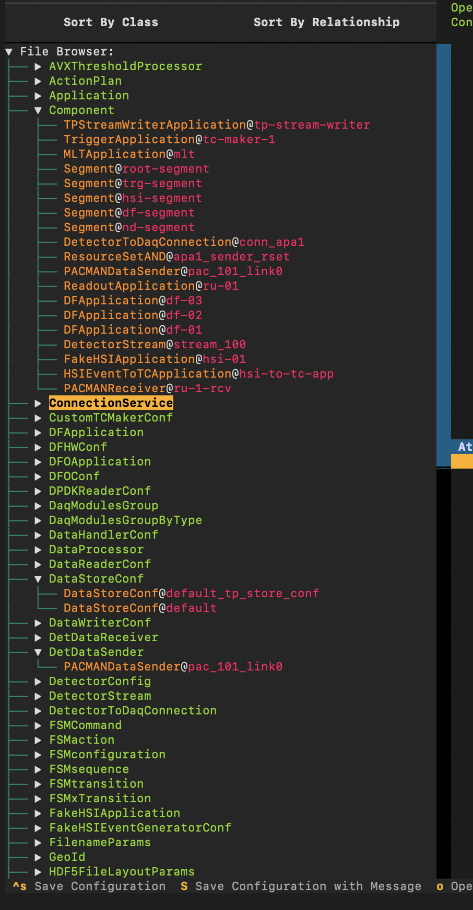
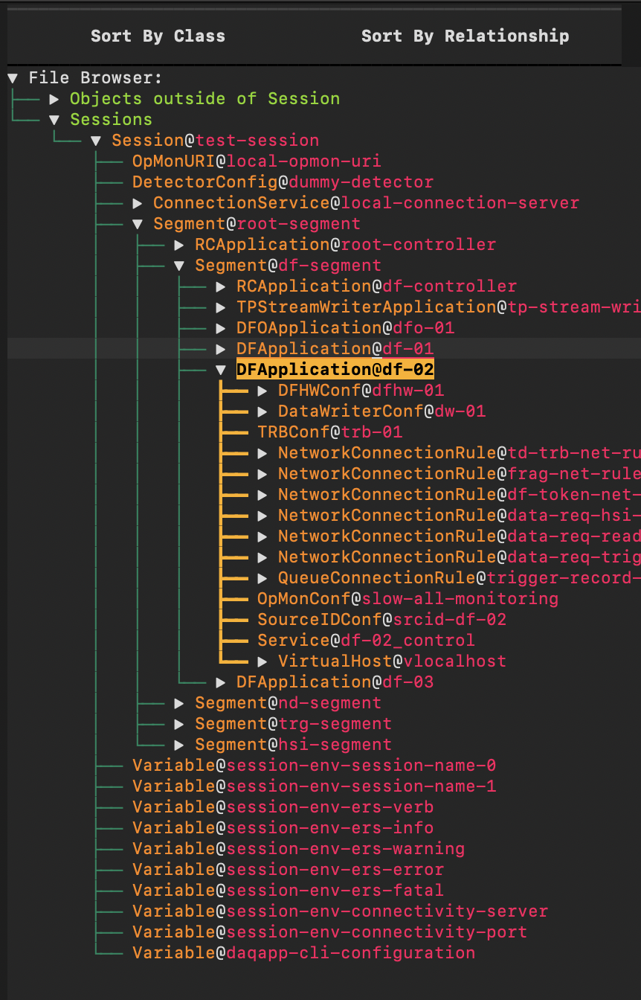
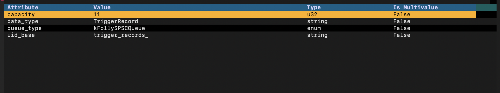
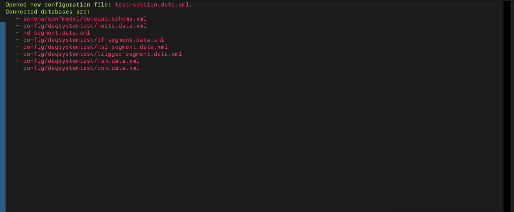

# Textual Database Editor (DBE)
## Introduction
Textual DBE is an attempt to replicate [DBE](https://github.com/DUNE-DAQ/dbe/tree/develop) within a fully Pythonic interface. The tool allows for browsing and modification of configurations with a text-based (but mouse-navigable) interface written in Python. **This is not intended to be a full production ready solution and is purely a proof of concept!**

## Usage
Open database editor with `textual_dbe`. This will open a splash screen displaying a blank logger + footer bar which contains a list of shortcuts.

In order to start editing configuration databases we first need to open a file! To do this press `o` which will open the following popup. Currently the `browse` option is not implemented so the full (or relative) file path to a database file is required instead.

Once this has been loaded in the screen should update. The editor is split into 3 segments:

### The Navigator

#### Browsing Objects
Configuration objects can be browsed via the navigation menu which has two views. The first breaks down configuration objects by class allowing for easy navigation without showing the underlying structure of the configuration. Note that all derived classes will be included as well for each category. For example `component` will include all `segment` objects.

The second "relationship" view will display the relationships between configuration objects. In addition "top level" objects are separated into `Sessions` and `Non-Sessions`. These non-session objects are effectively `dangling` and aren't used by anything within the configuration. If objects are related to multiple other objects within the configuration they will be displayed multiple times.

If an object in the navigator menu is selected it will be treated as `active` and its attributes will be displayed in the configuration object attribute table.

#### Disabling objects
Any objects that inherit from `component` can be disabled by selecting them + pressing `ctrl+d`.

### Configuration Object Attribute Table
The configuration table displays the values of attributes of the currently active configuration object. The values for these attributes can be modified by clicking on the row of the table which contains them. Type checking is very limited so this should be treated with caution

After an object has been modified, it can then be saved by pressing `ctrl+s` or saved with an additional message with `shift+S`.

### Logger
Logger simply displays warnings/updates. Not everything is fully logged and there are no verbosity levels.

## Known Issues
- Currently relationships for given configuration objects cannot be modified 
- Type checking is not robust at all for editing attributes
- All newly created objects are currently just saved to the active database
- No way to create new databases
- Relationship view simply displays objects rather than also displaying the name of the relationship

## To Do List
- [x] Add method to disable components
- [ ] Add more robust method for adding/modifying/deleting config objects
- [ ] Display name of relationship in relationship view

-----

_Last git commit to the markdown source of this page:_

_Author: Henry Wallace_

_Date: Tue Oct 8 10:25:05 2024 +0100_

_If you see a problem with the documentation on this page, please file an Issue at [https://github.com/DUNE-DAQ/daqconf/issues](https://github.com/DUNE-DAQ/daqconf/issues)_

