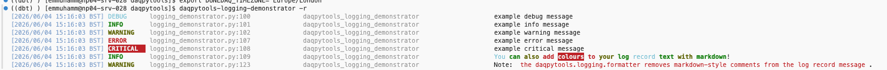
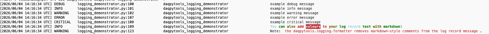

# Environment configurations 

`daqpytools` has the power for you to configure your current instance of the loggings! This allows each user to change the timezone and the color themes to suit them as the logs come out. 

The way this is configured is by setting environment variables. By default, these are _unset_ in the terminal, which daqpytools will read and resolve to a default value. These default values can be found in `logging/log_format.ini`.

If a non-default time zone/theme is preferred, it is recommended to set the env vars `DUNEDAQ_TIMEZONE` and `DUNEDAQ_LOGGING_THEME` in your `~/.bashrc`.

## Timezones

To change the timezone, simply do 

`export DUNEDAQ_TIMEZONE="[timezone]"`

eg. `export DUNEDAQ_TIMEZONE="UTC"`

Valid values are those that are listed in `pytz.all_timezones`.

An example with `Europe/London`.

## Logging themes

The themes are defined in daqpytools, in `logging/themes`, where you can see all the different themes available. To change between them, simply do 

`export DUNEDAQ_LOGGING_THEME="[themename]"`

eg. `export DUNEDAQ_LOGGING_THEME="dark"`

There are checks in place to ensure that the theme choice is valid before logs are printed. 

An example with `black`.

-----

_Last git commit to the markdown source of this page:_

_Author: Emir Muhammad_

_Date: Fri Jun 5 16:59:02 2026 +0100_

_If you see a problem with the documentation on this page, please file an Issue at [https://github.com/DUNE-DAQ/daqpytools/issues](https://github.com/DUNE-DAQ/daqpytools/issues)_

