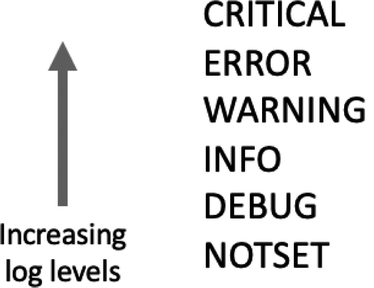
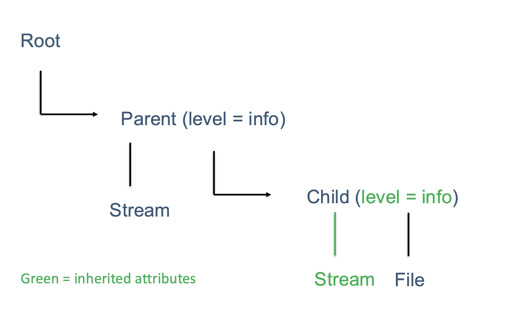

# Concepts: How logging works in DUNE-DAQ

This page explains the underlying concepts behind Python logging and how daqpytools builds on them. Reading this will help you understand *why* the how-to guides are structured the way they are.

For hands-on instructions, see the how-to guides. For the API reference, see the [reference](../../APIref).

---

## Python logging fundamentals

The bulk of the logging functionality in drunc and other Python applications is built on the [Python logging framework](https://docs.python.org/3/library/logging.html), with its mission defined below:

> This module defines functions and classes which implement a flexible event logging system for applications and libraries.

It is worth reading to understand how logging works in Python; the salient points are covered below.

In general, the built-in logging module allows producing severity-classified diagnostic events, which can be filtered, formatted, or routed as necessary. These logs automatically contain useful information including timestamp, module, and message context.

The core object in Python logging is the logger. A logging instance, `log`, can be initialized as follows. The phrase "Hello, World!" is bundled with other useful metadata, including severity level, to form a `LogRecord`, which is then emitted as required.

```python
import logging
log = logging.getLogger("Demo")
log.warning("Hello, world!")

>> Hello, World!
```

### Severity levels

Every record has an attached severity level, which can be used to flag how important a log record is. By default, Python has 5 main levels and one 'notset' level as shown in the image below:



It's worth noting that the severity levels are just enums in Python, with `CRITICAL` being 50, with increments of 10 down to 0 for `NOTSET`. More levels can be defined as required, see Python's [logging manual](https://docs.python.org/3/library/logging.html#logging-levels).

Each logging instance can have an attached severity level. If it has one, then only records that have the same severity level or higher will be transmitted.

```python
import logging
log = logging.getLogger("Demo", level = logging.WARNING)

log.info("This will not print")
log.warning("This will print")

>> This will print
```

### Handlers

Handlers are a key concept in Python logging, since they control how records are processed and formatted. DAQ uses several standard handlers as well as custom handlers.

The image below shows a file handler, a stream handler, and a webhook handler. Each record is processed and formatted by each handler and then transmitted through that destination.


Importantly, each handler can have its own associated severity level! In the example above, it is certainly possible to have the WebHookHandler to only transmit if a record is of the level Warning or higher.

### Filters

Filters are an important add-on for loggers, and their primary purpose is to decide whether a record should be transmitted. Filters can be attached to both a logger instance and its handlers.

When a log record arrives, it is first processed by filters attached to the logger. If it passes, the record is then passed to each handler and processed again by that handler's filters. A record is emitted only if those checks pass.


### Inheritance

Another key part of Python logging is inheritance. Loggers are organized hierarchically, so you can initialize descendant loggers by chaining names with periods, such as "root.parent.child".

By default, loggers inherit certain properties from the parent:
- severity level of the logger 
- handlers (and all attached properties, including severity level and filters on handlers)


A good model to think about while developing is shown below, where its thought of that the loggers 'get' the same handlers as their ancestors. Note one exception: they _do not_ inherit filters attached directly to the parent logger itself.



Behind the scenes, what actually happens is that the log record gets passed to the ancestor loggers; this is beneficial as it doesn't duplicate the two handles and instead passes the record around. See the [logging flow in the official Python3 docs](https://docs.python.org/3/howto/logging.html#logging-flow).


#### The root logger

In the native Python logging framework the highest possible logger is the (usually unnamed) root logger. For example, calling `logging.getLogger("top")` will usually yield you a logger called `{root}."top"`. Calling `logging.getLogger()` gets you the `{root}` logger.

As the root logger is the highest logger which every logger inherits from, modifying this logger will have a _global_ effect on all your loggers, which is almost always undesirable.


**Importantly, changing the root logger will affect the logging instances in other repositories too! This can lead to some undesirable behaviours, such as [this](https://github.com/DUNE-DAQ/drunc/blob/df51ce36cffe08efab6bd2a7a47554554deed22b/src/drunc/utils/utils.py#L64-L71).

This information is not actionable in and of itself, however this provides context on some of the [best practices](./how-to/best-practices.md) that have been laid out. 

---

## How daqpytools extends Python logging

The [daqpytools](https://github.com/DUNE-DAQ/daqpytools) package contains several quality-of-life improvements for DAQ Python tooling, including logging utilities.

These include:
- standardised ways of initialising top-level 'root' loggers
- constructors for default logging instances
- many bespoke handlers 
- filters relevant to the DAQ
- handler configurations

The core philosophy of the logging framework in daqpytools is that each logger should only have _one_ instance of a specific type of logger. This means that while a single logger can have both a Rich and a Stream handler, a single logger cannot have _two_ Rich handlers to prevent duplicating messages.

---

## Understanding handler streams and routing

Within the DUNE DAQ ecosystem, there are several handler configurations that work together. The native implementation supports three logical **streams**:

- **Base** stream: Standard logging (Rich, File, Stream handlers)
- **OpMon** stream: Monitoring-related output
- **ERS** stream: error reporting system routing (severity-driven handler selection)

You can think of streams as different "channels" where each has its own set of handlers. The key insight: **ERS Kafka handlers and Throttle filters need to be explicitly activated via `HandlerType` tokens** because they're typically only used when specifically configured.


This is why routing via `extra={"handlers": [...]}` matters — it tells the logger which stream/handlers to use for each record.

For a hands on explanation of these, please read the [how-to guide on how to use handlers and filters](./how-to/use-handlers.md)

---

## Further reading

- For how this routing model is implemented under the hood, see the [developer explanation](../../dev/).
  - The architecture reference includes diagrams which explain exactly how the routing works. See [here](../../dev/reference/architecture/).
- For how to configure ERS and advanced routing in practice, see [Configuring ERS](./how-to/configure-ers.md) and [Routing messages to specific handlers](./how-to/route-messages.md).

-----

<font size="1">
_Last git commit to the markdown source of this page:_


_Author: Emir Muhammad_

_Date: Wed Apr 15 15:41:46 2026 +0200_

_If you see a problem with the documentation on this page, please file an Issue at [https://github.com/DUNE-DAQ/daqpytools/issues](https://github.com/DUNE-DAQ/daqpytools/issues)_
</font>
