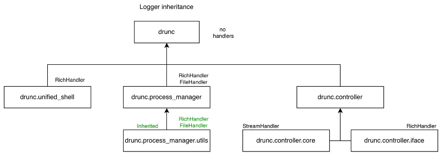

# Logging best practices

Before reading this, you really should have read the [Concepts](../explanation.md) page as that contains the basic context behind _why_ these best practices are recommended, as well as how to best utilise them.

---

The docs so far give a nice overview of how the logging tools work, but now you need to go ahead and use it! The tools are designed to be as customisable as possible with all the advanced features available for use, however to standardise logging deployment (and to make life easier) theres a couple of useful tips and standards to follow.

## Use of the root logger

For background information surrounding this tip, please see the explanation on the Python root logger found [here](../explanation.md).

**Always** set up a named pseudo-root logger in your application as close to initialisation of your application as possible. Use the daqpytools implementation `setup_root_logger` to do so.

To keep things safe and compartmentalisable, a pseudo-root logger should be defined very early on, and should contain no handlers. This has benefits of compartmentalising publishing, and making things clearer in the logs due to more traceable names.

In a similar vein, _never_ use `logging.basicConfig`. This tool will modify the root logger and will very easily cause interference with other apps. Its always safer to define the pseudo-root logger with `setup_root_logger` to keep things compartmentalised.

## Inheritance design

Following on setting up an empty root logger, the following image shows a good use of inheritance.

In this case, `drunc` serves as the pseudo-root logger in which no handlers are defined. All further loggers are inherited from this clean slate.

In each individual app, the handlers are defined there. For example, the unified_shell scripts use the `drunc.unified_shell` logger in which we require a RichHandler.

The power of inheritance is seen in the process manager example. Here, `drunc.process_manager` is defined with both the Rich and File handlers. Subsequent child loggers, such as the `.utils` logger, will _not_ need to define which handlers they want to use since through inheritance they immediately obtain the handlers of the parents.

As shown here, all loggers are initialised via `{pseudo_root_logger}.{parent}.{child}` names. Consider writing helper functions to facilitate this, or use Python's `__name__`.

## Where to define loggers

_Ideally_, loggers should only be defined once. While they _are_ singleton objects and there are simple ways to call an already defined logger, preference should be made to use inheritance to call 'new' loggers to keep things traceable.

A good place to define parent-level loggers with handlers (c.f. `drunc.process_manager`) is the module's `__init__` file. Subsequent new loggers can be defined in the various files of that Python module. For example, in the `process_manager/utils.py`, a new logger called `drunc.process_manager.utils` can be defined and used for the duration of that file, where it automatically inherits the handlers defined from the parent-level logger.

## Calling and configuring loggers

Once the pseudo-root logger is defined, you can use `get_daq_logger` to initialise it once. 

A useful tip for package managers is to define a function that prepends a prefix to actually inherit from the pseudo-root logger to ensure that inheritance is followed. See [here](https://github.com/DUNE-DAQ/drunc/blob/df51ce36cffe08efab6bd2a7a47554554deed22b/src/drunc/utils/utils.py#L52-L61) for an example.

Following the previous tip, if you feel the need to get an already-initialised logger with `get_daq_logger`, consider making a child.

All handlers you expect to use by default should be initialised with `get_daq_logger`.

## ERS implementation

To install ERS handlers on your logger, use `setup_daq_ers_logger`. You will then need to use a `LogHandlerConf` instance to activate them; this should be defined somewhere close to where `setup_daq_ers_logger` was called and should be callable at the point of use of the logger.

Remember that ERS environment variables need to exist at the point of ERS logger initialisation.

-----

_Last git commit to the markdown source of this page:_

_Author: Emir Muhammad_

_Date: Tue Apr 14 15:55:02 2026 +0200_

_If you see a problem with the documentation on this page, please file an Issue at [https://github.com/DUNE-DAQ/daqpytools/issues](https://github.com/DUNE-DAQ/daqpytools/issues)_

