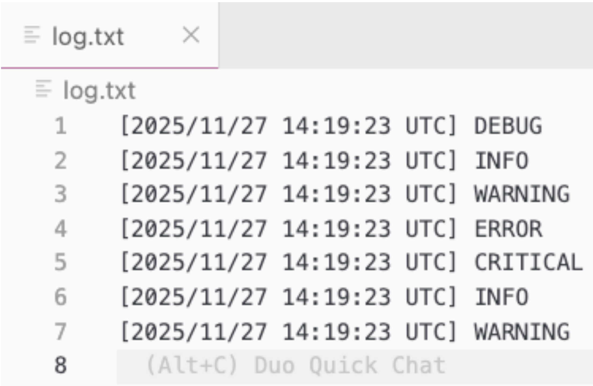
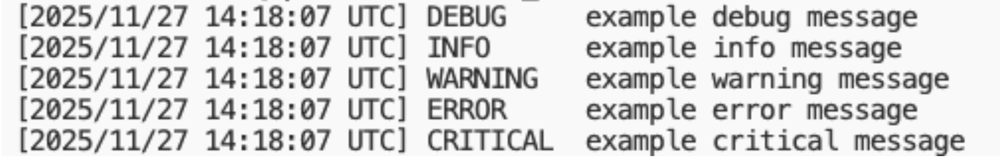

# How to use handlers and filters

This page walks through each available handler and filter in daqpytools with short examples.

Remember that by default, any messages received by the logger will be transmitted to _all_ available handlers that are attached to the logger.

For the full API reference (kwargs, types, defaults), see the [auto-generated reference](../../../APIref/).

---

## Rich handler

The Rich handler should be the 'default' handler for any messages that should be transmitted in the terminal. This handler has great support of colors, and delivers a complete message out to the terminal to make it easy to view and also trace back to the relevant message.


## File handler

As the name suggests, the file handler is used to transmit messages directly to a log file. Unlike stream and rich handlers, instead of defining a boolean in the constructor the user must supply the _filename_ of the target file for the messages to go into.



## Stream handlers

Stream handlers are used to transmit messages directly to the terminal without any color formatting. This is of great use for the logs of the controllers in drunc, which has its own method of capturing logs via a capture of the terminal output and a pipe to the relevant log file.

Note that stream handling consists of two handlers in daqpytools, one writing to `stdout` and one to `stderr`. The `stderr` stream is configured to emit only for records at `ERROR` or above.
 


## ERS Kafka handler

The ERS Kafka handler is used to transmit ERS messages via Kafka, which is incredibly useful to show on the dashboards messages as they happen.

This handler is not included in the default emit set. Extra configuration is required; for example:

```python
import logging

from daqpytools.logging import HandlerType, get_daq_logger

main_logger: logging.Logger = get_daq_logger(
    logger_name="daqpytools_logging_demonstrator",
    ers_kafka_session="session_tester"
)

main_logger.error(
    "ERS Message",
    extra={"handlers": [HandlerType.Protobufstream]} 
)
```

See [Configuring ERS](./configure-ers.md) for more details.


**Notes**

At the moment, by default they will be sent via the following:
```
session_name: session_tester
topic: ers_stream
address: monkafka.cern.ch:30092
```

## Throttle filter

There are times when an application decides to send a huge amount of logs of a single message in a very short time, which can overwhelm the systems. When such an event occurs, it is wise to throttle the output coming out.

The throttle filter replicates the same logic that exists in the ERS C++ implementation, which dynamically limits how many messages get transmitted. The filter is by default attached to the _logger_ instance, with no support for this filter being attached to a specific handler just yet.

Initializing the filter takes two arguments:
 - `initial_treshold`: number of initial occurrences to let through immediately
 - `time_limit`: time window in seconds for resetting state

The basic logic is as follows.


1. The first N messages will instantly get transmitted, up to `initial_treshold`


2. The next 10 messages will be suppressed, with the next single message reported at the end


3. The next 100 messages will be suppressed, with the next single message reported at the end


4. This continues, with the threshold increasing by 10x each time


5. After `time_limit` seconds after the last message, the filter gets reset, allowing messages to be sent once more

For the throttle filter, a 'log record' is **uniquely** defined by the record's pathname and linenumber. Therefore, 50 records that contain the same 'message' but defined in different line numbers in the script will not be erroneously filtered.

An example is as follows:

```python
import time

from daqpytools.logging import HandlerType, get_daq_logger

main_logger: logging.Logger = get_daq_logger(
    logger_name="daqpytools_logging_demonstrator",
    stream_handlers=True,
    throttle=True
)

emit_log_record = lambda i: main_logger.info(
    f"Throttle test {i}",
    extra={"handlers": [HandlerType.Rich, HandlerType.Throttle]},
)

for i in range(50):
    emit_log_record(i)
main_logger.warning("Sleeping for 30 seconds")
time.sleep(30)
for i in range(1000):
    emit_log_record(i)
```

Which will behave as expected.


**Note**
By default, throttle filters obtained via `get_daq_logger` are initialized with an `initial_treshold` of 30 and a `time_limit` of 30.


**Note**
Similarly to the ERS Kafka handler, this filter is not enabled by default, hence requiring the use of HandlerTypes. See [Routing messages to specific handlers](./route-messages.md) for more info.


-----

<font size="1">
_Last git commit to the markdown source of this page:_


_Author: Emir Muhammad_

_Date: Wed Apr 15 15:41:46 2026 +0200_

_If you see a problem with the documentation on this page, please file an Issue at [https://github.com/DUNE-DAQ/daqpytools/issues](https://github.com/DUNE-DAQ/daqpytools/issues)_
</font>
