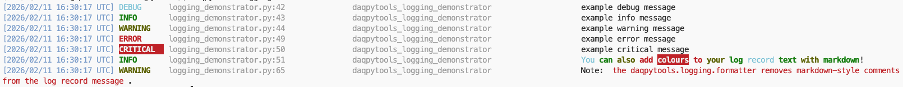

# Getting Started with Logging in DUNE-DAQ

By the end of this tutorial you will have a working logger printing colour-formatted output to your terminal. It should take about five minutes. No prior knowledge of Python logging is assumed — if you want to understand the concepts behind what you're doing, read [Concepts & explanation](./explanation.md) afterwards.

## Prerequisites

Before starting, make sure you have:

- The DUNE DAQ environment loaded (i.e. `dbt-setup-env` or equivalent has been run in your shell)
- `daqpytools` installed in your environment

## Step 1: Initialize a logger

Initializing a logger instance is simple:

```python
from daqpytools.logging import get_daq_logger
test_logger = get_daq_logger(
    logger_name = "test_logger", # Set as your logger name. Preferrably it should be relevant to what module / file you are in 
    log_level = "INFO", # Default level you will transmit at or above. In this case, Debugs will not be transmitted
    use_parent_handlers = True, # Just keep this true
    
    ## the rest are whatever handlers you want to attach. Read on for what exists. Rich is your standard TTY logger so the vast majority will be using this
    rich_handler = True, 
    stream_handlers = False # you dont really need this; its False by default
)
```

Please see the API reference of `get_daq_logger` [here](../../APIref/get_daq_logger/), or alternatively the code itself [here](https://github.com/DUNE-DAQ/daqpytools/blob/develop/src/daqpytools/logging/logger.py), to see what options exist in initialising `get_daq_logger`. 

This gives you a named logger with a single Rich handler attached, emitting at `INFO` level and above. Loggers in daqpytools are singletons — calling `get_daq_logger` with the same name twice will return the same instance, so it's safe to call this once at module level and reuse it throughout your code.

## Step 2: Emit your first messages

Emitting refers to the act of processing the log record and sending it out to its intended destination! You can emit your messages to the terminal, to a file, via a RESTapi, and so on. For this tutorial, we are simply emitting a message to the terminal. 

```python
test_logger.info("Hello, world!")

test_logger.info(
        "[dim cyan]Look[/dim cyan] "
        "[bold green]at[/bold green] "
        "[bold yellow]all[/bold yellow] "
        "[bold red]the[/bold red] "
        "[bold white on red]colours![/bold white on red] "
)
```

You should see colour-formatted output in your terminal, something like this:



The Rich handler supports the full [Rich markup syntax](https://rich.readthedocs.io/en/stable/markup.html) inline in your log messages.

## Next steps

- To explore the full range of available handlers and filters interactively, run the logging demonstrator with the DUNE environments loaded:
  ```
  daqpytools-logging-demonstrator
  ```
  View the help string to learn more, and the script itself in the repository to see how it is implemented.
- To understand *why* logging works the way it does, read the [Concepts & explanation](./explanation.md).
- To learn how to use specific handlers and filters, see the [How-to guides](./how-to/use-handlers.md).
- For a full API reference, see the [API Reference](../../APIref/).
- If you are introducing logging to your Python repo, or upgrading an existing implementation, **please** read the [Logging best practices](./how-to/best-practices.md).


-----

<font size="1">
_Last git commit to the markdown source of this page:_


_Author: Emir Muhammad_

_Date: Wed Apr 15 15:41:46 2026 +0200_

_If you see a problem with the documentation on this page, please file an Issue at [https://github.com/DUNE-DAQ/daqpytools/issues](https://github.com/DUNE-DAQ/daqpytools/issues)_
</font>
