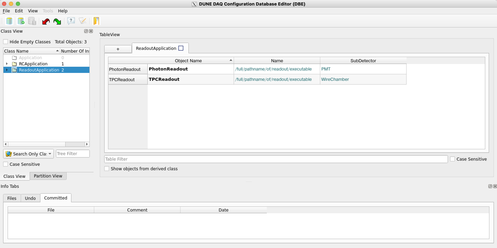
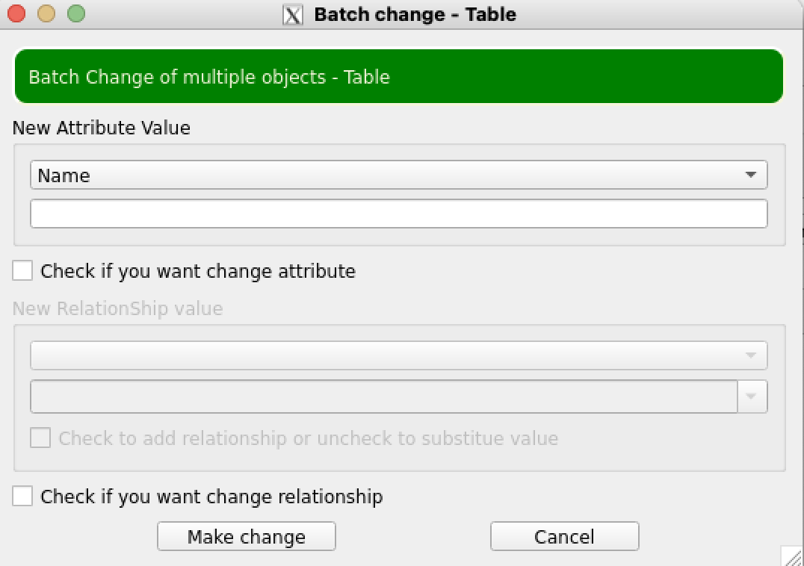
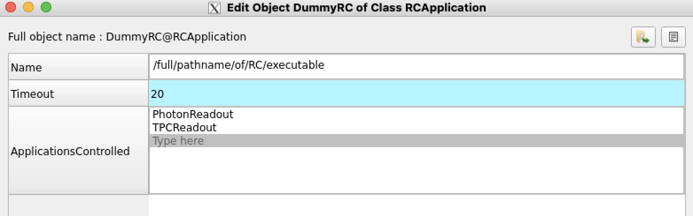
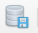
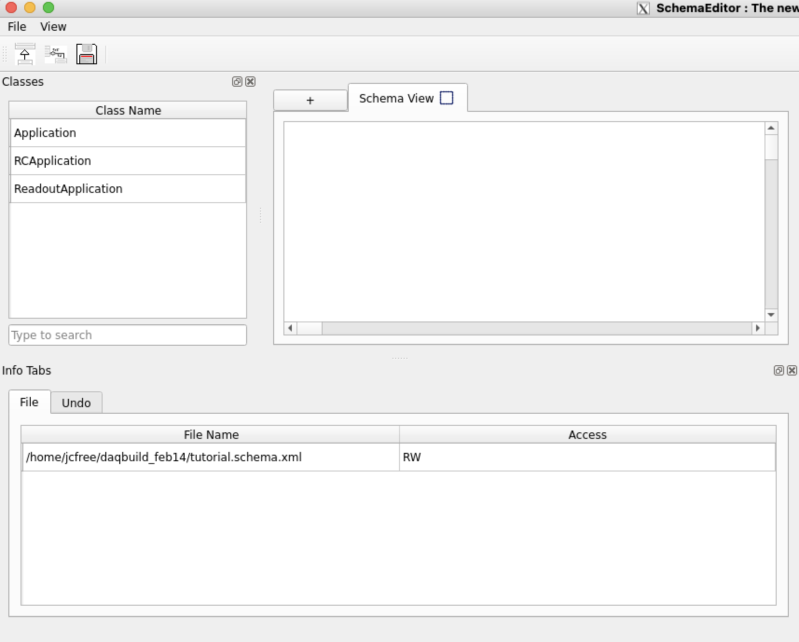
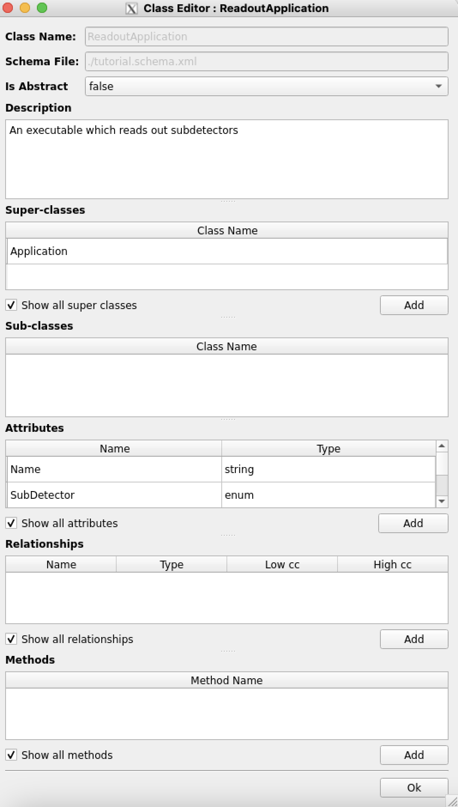
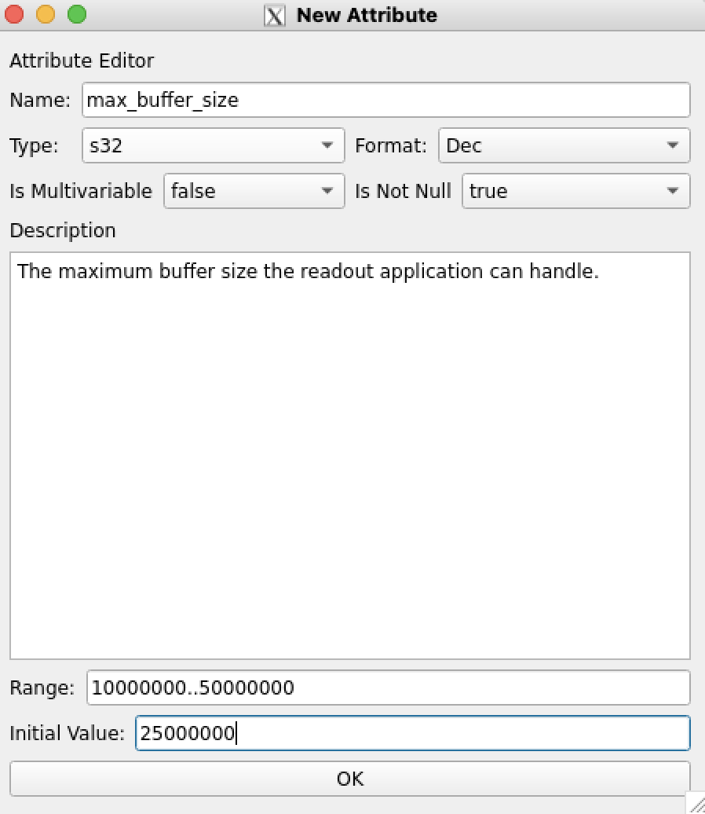
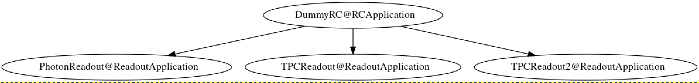

# DBE (DataBase Editor)

## Intro

The DBE package provides a GUI interface to the OKS suite, allowing you to edit both schema files and data files. Note that these instructions will assume you have a basic familiarity with OKS as [described here](https://dune-daq-sw.readthedocs.io/en/latest/packages/dal/). They also assume that you [know how to download and build repositories](https://dune-daq-sw.readthedocs.io/en/latest/packages/daq-buildtools/) and are able to display windows from your command line (e.g. `xclock &` or `emacs &` pop up windows for you). 

While DBE was [originally written as part of the ATLAS TDAQ effort](https://gitlab.cern.ch/atlas-tdaq-software/dbe.git), it has been modified to build within the DUNE DAQ framework. To get started working with DBE, you'll need to do two things. (1) load in the core OKS packages by setting up a work area, and (2) run `spack load dbe`. This second command is needed since loading in `dbe` will cause emacs to no longer work in the terminal, an undesirable side effect developers don't want to have to experience whenever they set up a work area for reasons unrelated to dbe. 

## Walkthrough, Part 1: Editing Objects in a Configuration

Let's get started seeing what functionality DBE provides. You can do the following:
```
tutorial.py   # Generates a data file, tutorial.data.xml, which we can use for educational purposes 
dbe_main -f ./tutorial.data.xml
```
`tutorial.data.xml` describes a very simple DAQ system which consists of one run control, one TPC readout application and one photon readout application; it's covered more thoroughly [here](https://dune-daq-sw.readthedocs.io/en/latest/packages/dal/#overview-of-tutorialdataxml). When DBE launches, you'll see a subwindow on the left side of the DBE window titled "Class View". As you can see, this lists the classes available to the data file you provided DBE, as well as the number of objects of each class type. Click on `ReadoutApplication`, and you'll see the following:



...i.e., we have a toy readout application for photon detection and a toy TPC readout application. 

Let's open a second terminal and edit the `tutorial.data.xml` file. Take the `TPCReadout` object at the bottom of the file, i.e.
```
<obj class="ReadoutApplication" id="TPCReadout">
 <attr name="Name" type="string" val="/full/pathname/of/readout/executable"/>
 <attr name="SubDetector" type="enum" val="WireChamber"/>
</obj>
```
and cut-and-paste a copy of it below the original. Then for the second copy, make sure to give it a unique ID, e.g. changing `TPCReadout` into `TPCReadout2`; OKS requires that each object has a unique ID. Save the file. You should see two things have changed in the GUI: (1) a message saying `Database reloaded due external changes` and (2) the addition of the second TPC readout application which you created. DBE keeps track of edits to the XML database file, and notices when it's been changed. Hit `OK` in the message to close it. 

Now let's perform some edits within the GUI. First, as an example of how you can change a variable across multiple objects, do the following: click on the text box titled `Table Filter` below the list of readout object. Our three objects have the IDs `PhotonReadout`, `TPCReadout` and `TPCReadout2`. Let's change the name of the TPC readout executable. Type `TPC` and you'll see that DBE is now displaying only the two objects whose names begin with those three letters. Click on the `Edit` option in the upper left of the window and select `Batch Change Table`. You'll see a window like the following pop up:



While there's a dropdown menu for `New Attribute Value`, let's stay with the `Name` attribute value for editing purposes. In the text box directly below the dropdown menu, you can enter any string, e.g. `/new/name/of/tpc/readout/executable`. Then check the checkbox `Check if you want to change attribute` (unclear why ATLAS required this) and click the button `Make change` at the bottom of the window. You'll see the value update in the main DBE window. If you delete the `TPC` from the `Table Filter` text box you can return to the full listing of readout objects. 

Let's now make changes to the run control application. In the `Class View` pane on the left side of the window, double click on `RCApplication`. You'll see that the run control application (ID `DummyRC`) has replaced the readout applications in the table on the right. Under the `Object Name` column header, double click on the boldface `DummyRC`, and a window will pop up which looks like the following:



If you double click on `Type here` in the `Applications Controlled` section, you have the option of adding an application under run control. You can do so either by typing the ID of the application, or - easier - clicking on the little down arrow that's appeared on the right and selecting the application you want to add. Afterwards, if you click on the `20` for the `Timeout`, you can change its value. For fun, see what happens if you try to save a value greater than 3600. Play around with edits as you wish and then click the `Apply` button at the bottom of the window, followed by `Close`. 

At this point, let's save our work. Back in the main window of the database editor, near the upper left hand corner, click on the icon which looks like the following:  Enter a commit message and hit `OK`, you should see another window pop up saying `List of modified files committed to the database`. Hit `OK` in that window. Then navigate to the `File` drop down in the far upper left of the main window, and select `Exit`. We're done editing the configuration for now; now we'll edit an actual class.   

## Walkthrough, Part 2: Editing Classes in a Schema

First things first: since the schema file off of which `tutorial.data.xml` is based in `cvmfs`, we can't edit it directly. So instead we'll copy it over:
```
cp $DAL_SHARE/schema/dal/tutorial.schema.xml .
```
and modify `tutorial.data.xml` so it points at the copied schema file, not the original:
```
sed -r -i 's!.*tutorial.schema.xml.*!<file path="./tutorial.schema.xml"/>!' tutorial.data.xml
```
Now let's open up the copied schema file:
```
schemaeditor -f ./tutorial.schema.xml
```
and you'll see a window like this (probably with a lot of unwanted white padding, not shown here):



Let's add an Attribute to the ReadoutApplication class. In the `Class Name` pane on the left, double click on `ReadoutApplication`. A new window will pop up which looks like the following:



In the `Attributes` section of the window, double click on the `Add` button. Another window, this one called `New Attribute`, will pop up. You can fill it in, e.g., like so:



where I've defined a `max_buffer_size` Attribute, which you can set anywhere from 10 MB to 50 MB, with a default value of 25 MB. Please note the dropdown menu selections of data type (4-byte integer) and the setting of `Is Multivariable` to `false`; when set to `true` OKS would expect a list, not a single value. Click `OK` to save your changes. Then click `OK` to exit out of the class editor window. Finally, click on the `File` drop down list in the upper left hand corner of the main window and select `Save Schema`. Then exit out, by selecting `Exit` from the same drop-down menu. On exiting out, you may be again prompted to save the schema, in which case save it again; this suggests there may be an issue with the regular `Save Schema` option. 

You can now see the changes you've made, whether by opening up `tutorial.schema.xml` or by re-running `dbe_main -f tutorial.data.xml` and looking at `ReadoutApplication` instances. 

## Creating A Diagram of Your Configuration

A discussion of DBE wouldn't be complete without mention of its diagram-creation tool, `dbe_gtool`. E.g., to create a diagram of the configuration we've edited in this tutorial, you can do the following:
```
tmpfile=$( mktemp )
dbe_gtool --file ./tutorial.data.xml --result $tmpfile
dot -Tsvg $tmpfile > tutorial_diagram.svg
```
...where you can then display `tutorial_diagram.svg` using, e.g., `gimp` or your web browser. Please note that depending on the display tool you choose you may need to display the diagram from a different terminal than the one in which you have your work area set up due to compatibility issues with the `cairo` package which Qt depends on. The diagram will look something like the following:




-----

<font size="1">
_Last git commit to the markdown source of this page:_


_Author: John Freeman_

_Date: Sat Jul 15 12:45:51 2023 -0500_

_If you see a problem with the documentation on this page, please file an Issue at [https://github.com/DUNE-DAQ/dbe/issues](https://github.com/DUNE-DAQ/dbe/issues)_
</font>
