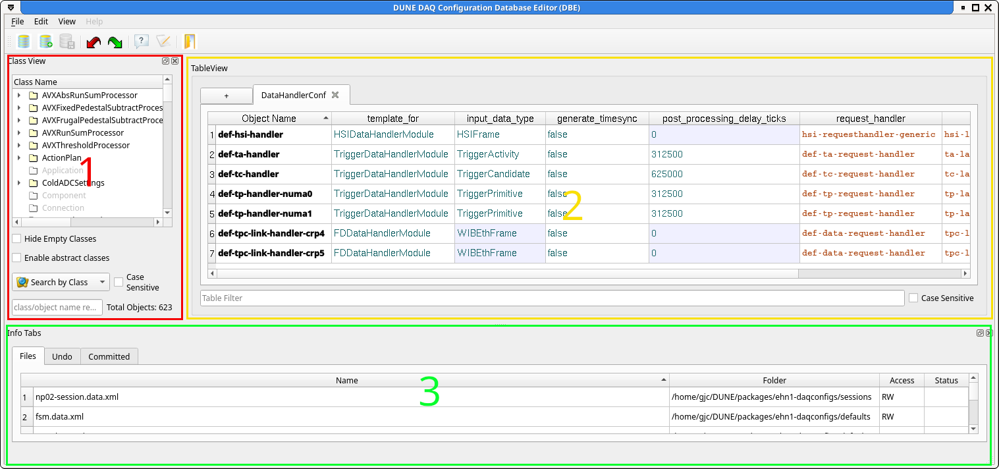
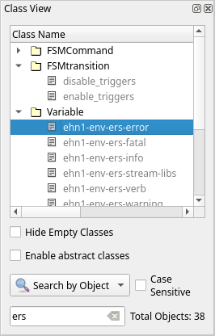
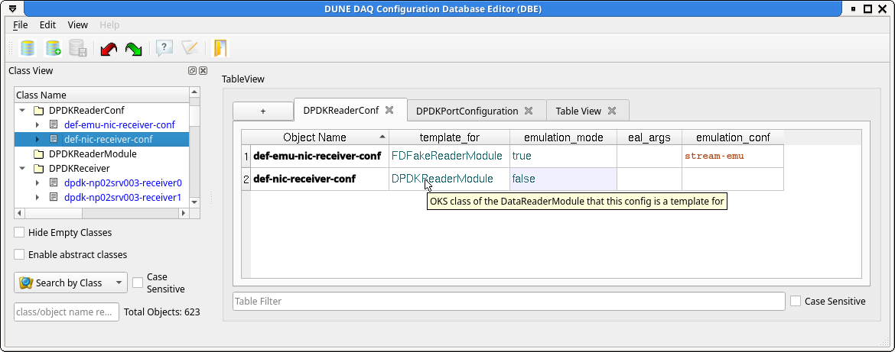
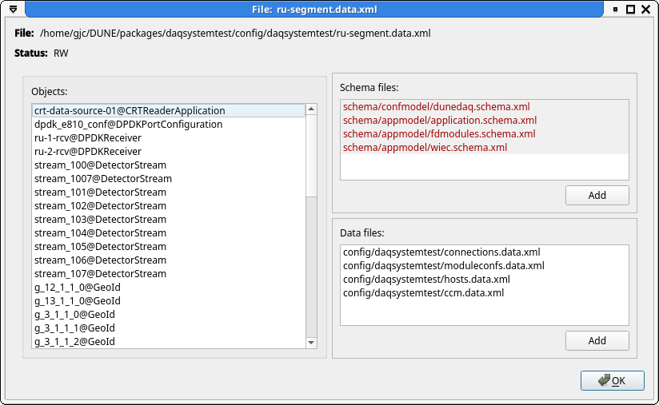
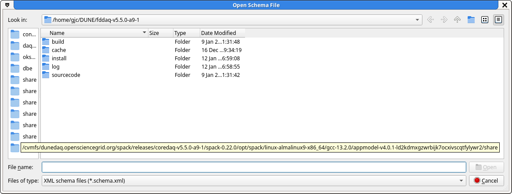
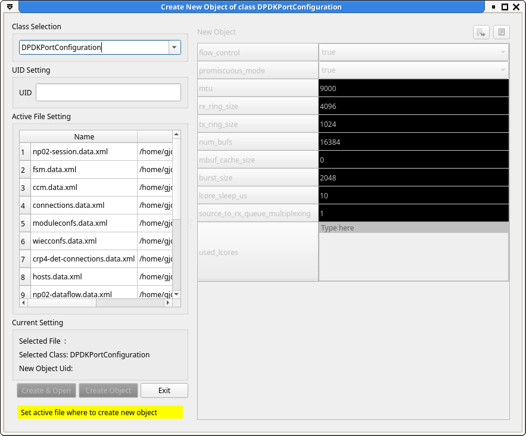
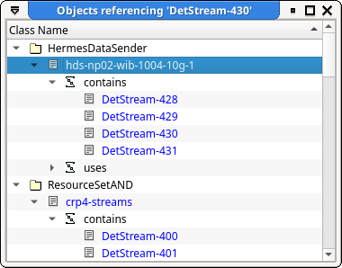
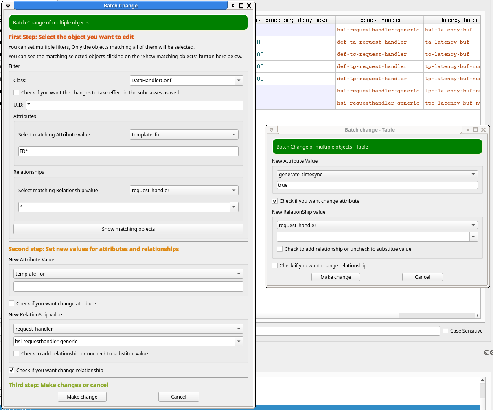

# The OKS database editor: `dbe_main`

## Prerequisite

 Before running either `dbe` or [`schemaeditor`[(schemaeditor.md) you
must load the dbe spack package with `spack load dbe`. This can have
unwanted side effects like running the wrong version of Python due to
spack messing with your PATH and LD_LIBRARY_PATH. To avoid this, keep
your editing sessions in a different window to your normal development
or create an alias /shell function like:

```
function dbe_main () 
{ 
    bash -c "spack load dbe; command dbe_main $@"
}
```

## Starting the editor

 Just running the command `dbe_main` will bring up the database editor
 with no database loaded. You can then open an existing database or
 create a new database from the items on the File menu or the
 tool-bar. If you want to specify an existing database on the command
 line, you must include the `-f` option before the name of the
 file. File names not beginning with '/' are taken to be relative to
 first the current directory, then each member of the list in
 `DUNEDAQ_DB_PATH` until a match is found.

## Structure of the editor

 

 The main window below the tool-bar is initially split into 3 main
parts, the `Class View` (1), the `Table View` (2) and the `Info Tabs`
(3). The `Class View` and the `Info Tabs` can be undocked and moved
out of the main window. Each of the views can also be enabled or
disabled from the `View` menu.

## Navigating with the `Class view` (1)


The `Class View` is a dock-able widget originally on the left of the
main window. The`Class View` is a tree which displays a list of class
names and the number of objects of that class that exist in the
database. Where the number of objects of a class is non-zero, the item
can be expanded to display the list of objects. Further, if an object
has relationships to other objects, the object can be expanded to show
the list of relationships which in turn can be expanded to list the
objects they are referencing.

The items in the `Class View` can be selected in the normal way with
either the mouse or the keyboard (arrow keys move up and down and
open/close lists of objects, alphabetic keys move to the first/next
item starting with that character).


* Activating a class name will display all instances of the class in
the current `Table View`.


* Activating an instance in the `Tree view` will open the `Object
Editor` to edit that instance.

### Abstract classes

Abstract classes are usually shown in grey on the `Class View` and are
not selectable. If you want to see objects of all the subclasses of an
abstract class, you can check the `Enable abstract classes` check
box. With this selected, the abstract classes become selectable and
activating them will show all instances of of all subclasses in the
`Table View`. **Beware** the column headings are taken from the base
class and derived classes may have more attributes/resources or a
different ordering.

### Tooltips

Tooltips show the descriptions of the classes (assuming they have one).

### Filtering the view

To filter the list of classes to see just a subset that you are
interested in, there is a text entry field at the bottom of the `Class
View` where you can enter a regular expression to be matched against
the class names. The matching can be done on class name or object name
and case sensitive or not according to the settings of the check box
and combo box just above the text input.

For example to find all objects including 'ers' in their name, enter
'ers' in the search box and select `Search by Object` from the combo
box above it.  

## Using the `Table view` (2)

 The `Table
View` area is a set of tabs which display the attributes and
relationships of objects in the database. A new tab can be opened by
selecting the '+' in the top left corner.

The content of a tab is selected from the `Class View`
widget. Activating a class name will add all instances of that class
to the current `Table View` tab. Activating individual instances will
add only those selected to the tab. Instances can also be dragged from
the `Class View` and dropped onto the `Table View`.

Attributes which are set to their default values are marked with a coloured background.


* Activating a row in the `Table View` will open the `Object Editor` on
that instance.

* Double clicking on an attribute will allow editing of
the attribute directly in the cell

* Double clicking on a relationship will pop
up a dialogue box allowing selection of objects of the correct type.

### Filtering the view

Like the `Class View`, there is an edit box for an object name filter
to limit the display to only matching objects.

### Context menu


The `Table view` context menu gives you several options, allowing you
to find all objects that refer to the current object, find an object
within the current view by name, copy edit or delete the current
object.


## The `Info Tabs` (3)

The `Info Tabs` section consists of 3 tabs, the `File View`, the
`Undo` control and the `Commits log`.

### The `File View` tab

  The `File View` lists all the loaded data files along with their
read/write access and modified status. The list of files included by
the currently selected file can be updated by pulling up the include
file editor by selecting `Add/Remove Files` from the context menu. A
window showing information about the file, including a list of objects
defined in it, can be activated by selecting `File information` from
the context menu or by double-clicking on the appropriate row.



#### File Information window

  The File Information window has 3 panels showing a list of all the
objects in the file and lists of all the schema and data files that
this file includes. The schema and data file panels have buttons
allowing you to add further includes and this functionality is also
available via the context menu. This is a simpler interface to
updating the list of includes than using the `Include file editor`.

  If the file contains any objects with relationships to objects in
files that are not included or the schema file in which the class is
defined is not loaded, a 4th panel with warning messages will be
shown.

  Both the schema file and data file panels have an 'Add' button
allowing more includes to be added. These will bring up a standard
file selection dialogue with the left-hand column populated by the
paths from `DUNEDAQ_DB_PATH`.


### The `Undo` tab

The `Undo` tab lists all the modifications that have been made since
the last commit to the database. You can go back to any point in the
history by selecting the line above the change you want to
revert. Apart from navigating the Undo list with the mouse or
keyboard, there are also buttons on the tool-bar to undo/redo changes.


## Creating new objects

New objects can be created by from the `Class View` panel by using the
context menu or the short cut `Ctrl-N` (also from the context menu in
an active `Table View` tab). This brings up the `Object Editor` for
the selected class. Before you can set the values of the attributes and
relationships, you have to set the UID and select the file to store
the object in.  

New objects can also be created from the context menu in the `Table
View`, either an empty one or a copy of an existing object.

## Renaming objects or moving to a different file

To rename or move an object, bring up the object editor for that object
and use the buttons in the top right-hand corner.

## Finding what uses a specific object

To find all objects that refer to an object, first select the object
in the table view. Then use one of the `Referenced By` items on the
context menu. This will pop up a new window showing a class tree of
all the objects that refer to it.



## Changing values in multiple objects in one go (batch changes)

Occasionally, you may need to change the value of the same attribute
across many objects.  Hidden away on the `Edit` menu are two batch
change items to do this. `Batch Change` and `Batch Change Table`


* `Batch Change` allows you to change attributes/relationships of all
objects of a class with a UID matching an expression.


* `Batch Change Table` allows you to change attributes/relationships
  of objects in the current `Table View`.

Both menu items will pop up dialogue boxes with both attributes and
relationship sections. You have to select the appropriate check-box to
determine which you are changing.



`Batch Change Table` only allows you to set a new value for all items
in the table.

`Batch Change` is more flexible in that it allows you to filter on the
current values of attributes/relationships and apply new values for
only matching objects. In the example screen-shot shown above, we
changed the `request_handler` relationship for all `DataHandlerConf`
objects whose `template_for` attribute started with 'FD'.

-----

<font size="1">
_Last git commit to the markdown source of this page:_


_Author: Gordon Crone_

_Date: Tue Jan 13 09:48:54 2026 +0000_

_If you see a problem with the documentation on this page, please file an Issue at [https://github.com/DUNE-DAQ/dbe/issues](https://github.com/DUNE-DAQ/dbe/issues)_
</font>
