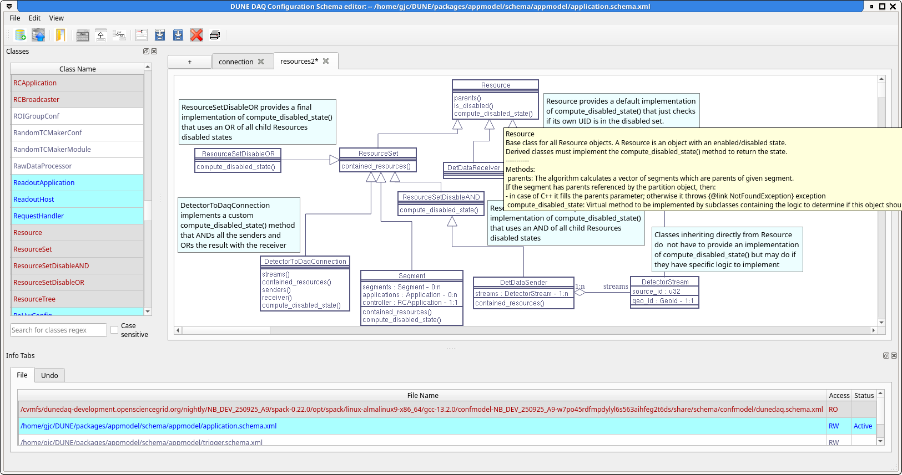
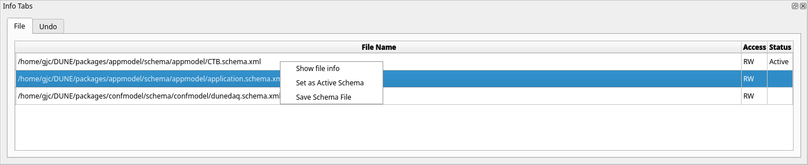
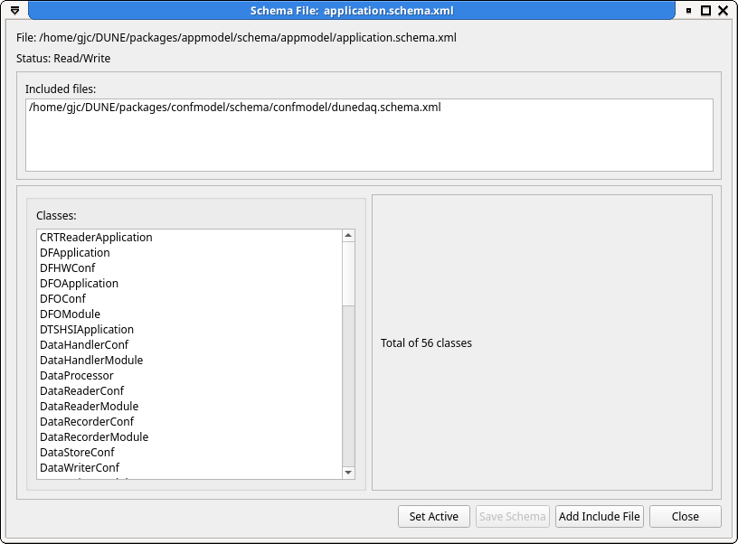
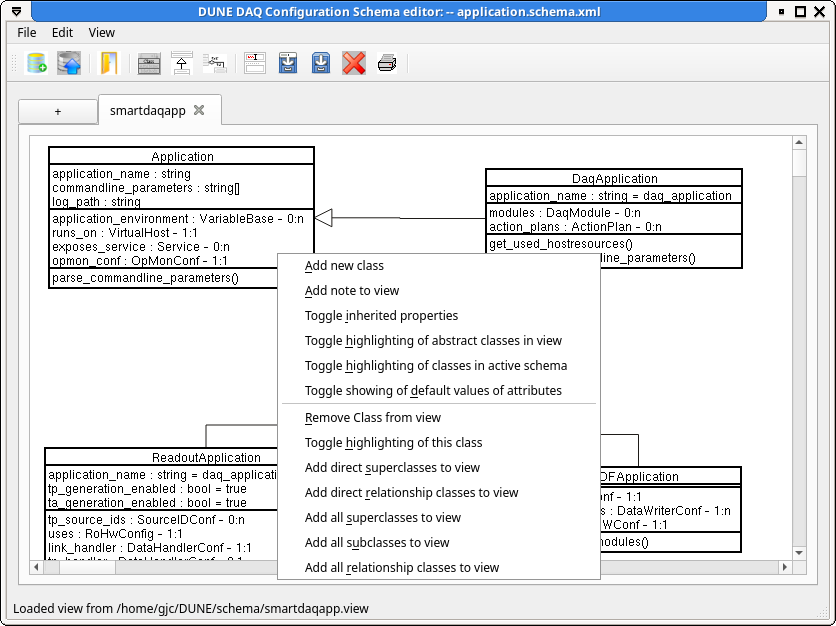
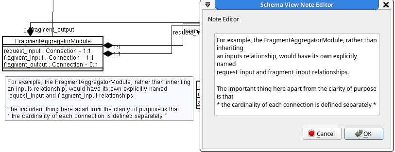

# The OKS schema editor: `schemaeditor`

## Prerequisite

 Before running either `schemaeditor` or `dbe` you must load the dbe
spack package with `spack load dbe`. This can have unwanted side
effects like running the wrong version of Python due to spack messing
with your PATH and LD_LIBRARY_PATH. To avoid this, keep your editing
sessions in a different window to your normal development or create an
alias /shell function like:

```
function schemaeditor () 
{ 
    bash -c "spack load dbe; command schemaeditor $@"
}

```



## Starting the editor

 Just running the command `schemaeditor` will bring up the
schemaeditor with no schema files loaded. You can then either open an
existing schema file `File -> Open Schema` (or Ctrl+O) or create a
new empty schema file with `File->Create new schema` (or Ctrl+N).

To start with an existing schema file, use the `-f` option.

## Setting the 'Active' schema file

 All new classes are created in the active schema file. This will
initially be the file you loaded or created above unless the loaded
file is read-only or locked by another process. To make another file
the active schema file, use the context menu in the files tab
(right-click).

_NB:_ You cannot add new classes unless you have made a schema file
'Active'.



## Handling include files

 Most schema files will want to include at least the core dunedaq
schema (dunedaq.schema.xml) from confmodel. To add an include to the
currently active schema file, either `File->Show schema file info`
(<Ctl>I) or right click on the name of the schema file in the File
panel. This will bring up a dialog box showing information about the
selected or active schema file with a list of included files and the
classes contained in this file. This dialog box has a button for
adding include files and if any of the classes refer to classes that
are not contained in any included file another button to automatically
add all the required schema files. The `Add Include File` button
brings up a standard open file dialog with all the elements of
`DUNEDAQ_DB_PATH` in the sidebar (use the tooltips to distinguish among
the multiple `share` entries).




 A list of which classes are in a given schema file can also be seen
by opening a file info window from the file tab conext menu (or for
the active file Ctl-I). This class list has a context menu allowing
adding, editing and removing classes.

## Saving files

 To save all modified schema files, `File->Save Schema` (Ctrl+S). To
save only a single file, use the context menu in the File tab. This
also allows you to save files that have not been updated (sometimes
useful to ensure proper formatting of files edited outside of the
schemaeditor).

## Editing classes

 To edit a class, activate (double click or select and hit enter) the
class name in the `classes` panel, double click on the class in the
`class view` panel or select the edit option from the context menu in
either panel. It is possible to open the class editor for a read only
class from the `classes` panel but the editor will not allow you to
make any changes.

## Adding new classes

 To add a new class Ctrl+A anywhere will bring up the new class
dialogue box. From here you can define the attributes and
relationships of your new class and set its superclass inheritance
from the list of existing classes.

Selecting "Add New Class" from the context menu of the class list in a
file info window will add a new class to that file, automatically
switching the 'active' file.

New classes can also be added from the context menu in the schema view
tabs. This will place the new class on the schema diagram at the
current cursor position.

## Moving classes between files

To move a class to a different file, open the class editor for the
class and press the Move button near the top. Alternatively, from a
file info window for the file that currently contains the class,
select the class from the class list and activate the "Move Selected
Class" item from the context menu. This will open a dialog box asking
you to select the destination. Unfortunately, drag and drop between
file info windows is not (yet) available.

## Schema diagrams

 To create a class diagram of the defined classes, simply drag the
classes you are interested in from the 'Class Name' list onto a schema 
view tab. Relationships and inheritance connections will be
automatically drawn. By default, only the direct properties of the
classes are shown, to display all properties including those inherited
the context menu in the schema view panel includes an option to toggle
inherited properties. The context menu on an individual class within
the view allows the addition of all its parent/child/related classes to
the view.



Multiple views of the schema can be created by selecting the "+"
button next to the view tabs. A tab can be renamed by selecting the
'Name View' button on the toolbar. Tabs can be closed by selecting the
cross on the top corner of the tab or with the short cut Ctl-W.

### Highlighting classes

Classes may be highlighted in different colors/fonts. The colors and
fonts can be set from the `Color/font Settings` item on the `Edit`
menu.

#### Highlighting classes from the active schema file

The classes contained in the current schema fie can be highlighted by
selecting this option from the context menu. This can be useful to see
at a glance which classes are in which file. Changing the active file
from the `File info` tab will change which classes are highlighted
accordingly.

#### Highlighting selected class

The class under the cursor can be highlighted by selecting the
appropriate item from the context menu. 

### Tool-tips

Hovering the mouse over a class in the schema view will bring up a
tool-tip with the description fields of the class and all its direct
attributes, relationships and methods.

### View files

The current schema diagram can be saved from the 'Save View' or 'Save
View as' buttons on the toolbar or printed via the 'Print View'
button. These options also exist in the View menu along with an option
to export to an SVG file.

Views can be loaded from files by using the Ctl-V short cut or
selecting 'Load View' from the View menu. Views load into new tabs
unless the current tab is empty.

### Notes

Notes can be added to the view by selecting 'Add note to view' from
the context menu. Notes are currently written in very simple boxes
with plain text. Line breaks should be added by hand.




## Keyboard short cuts

| Key   | Action | Notes |
|-------|:-------|-------|
| Ctl-A | Add new schema class | Only available when there is an 'Active' schema file|
| Ctl-N | Create New schema file |
| Ctl-O | Open new schema file  | 
| Ctl-I | Open file info dialog  | Only available when there is an 'Active' schema file|
| Ctl-S | Save modified schema files  ||
| Ctl-V | Load View ||
| Ctl-W | Close tab ||
| Ctl-Q |  Quit  ||


-----

<font size="1">
_Last git commit to the markdown source of this page:_


_Author: Gordon Crone_

_Date: Thu Oct 30 15:29:19 2025 +0000_

_If you see a problem with the documentation on this page, please file an Issue at [https://github.com/DUNE-DAQ/dbe/issues](https://github.com/DUNE-DAQ/dbe/issues)_
</font>
