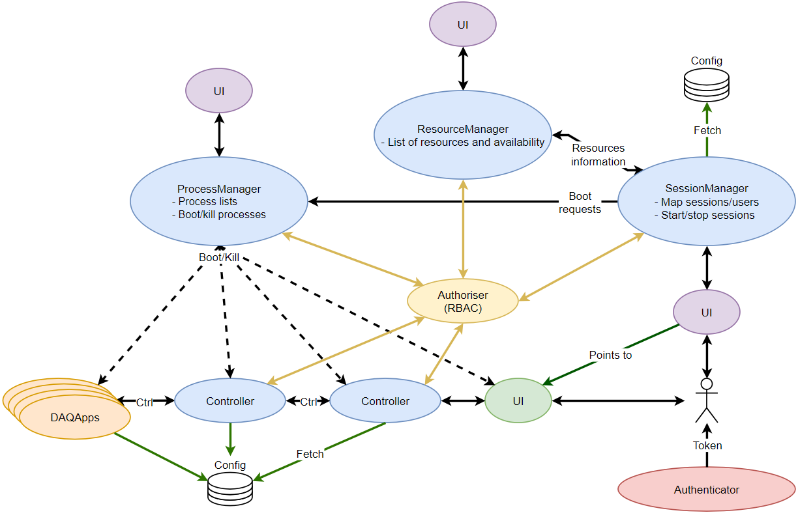
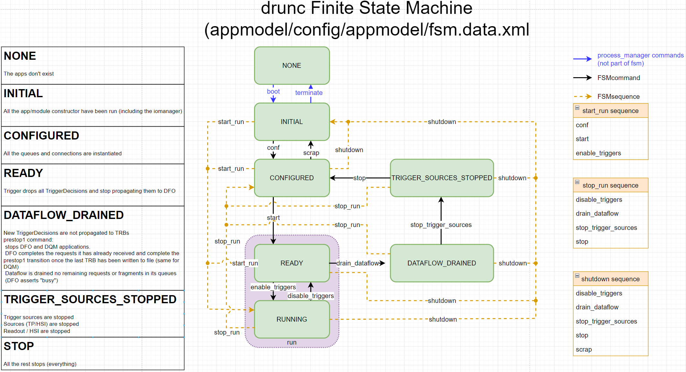
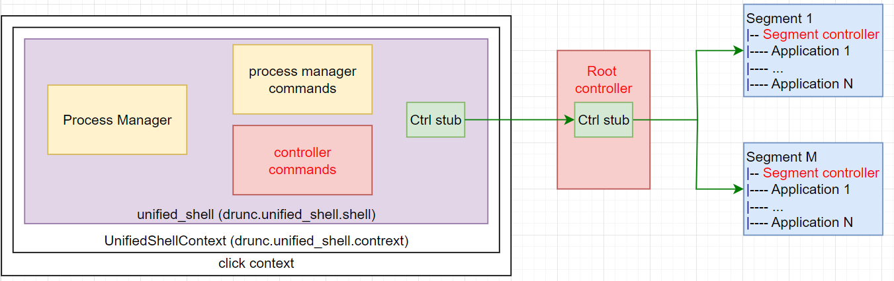

# DUNE Run Control (drunc)

This software defines a flexible run control infrastructure for a distributed DAQ system defined in a set of configuration files used at run time for DUNE. Operation of the experiment is defined through a finite state machine (FSM) which describes the operational state of the DAQ. 

The project is still under development, and as such will still have bugs or features that users may want. If you encounter any of these please raise an issue and describe it clearly so that we can take resolve it easily.

## Installation
### With the full `DUNE-DAQ` software stack
#### From a `fddaq` release
Once you have [set up your`fddaaq-v5.x.y` release](https://github.com/DUNE-DAQ/daqconf/wiki/Setting-up-a-dunedaq-v5.1.0-Development-Area), a tagged version of `drunc` has already been built and deployed. 
#### From a nightly release
Once you have [set up your nightly release](https://github.com/DUNE-DAQ/daq-buildtools?tab=readme-ov-file#creating-a-work-area), `develop` as of midnight CEST from the previous day has already been built and deployed.
#### For the most recent
If you are looking for the latest features stored on `develop`, you will need to
```bash
cd sourcecode                                               # save the repository in the sourcecode subdir
git clone git@github.com:DUNE-DAQ/drunc.git -b develop      # clone the latest verified working version of the code
cd drunc                                                    # enter the drunc repo
pip install .                                               # ... install this package if you are planning to modify you can use `pip install -e .`
cd ../..                                                    # return to root of the work dir
dbt-workarea-env                                            # updates the path env vars
```
and if you are using the same repository, to avoid installing `drunc` every time you `git pull`, instead of `pip install .` you can use 
```bash
pip install -e .
```
which will by default install the changes made.

### As standalone
You can run `drunc` without the full software stack. If this is your planned use case, to install it run
```bash
cd sourcecode                                               # save the repository in the sourcecode subdir
git clone git@github.com:DUNE-DAQ/drunc.git -b develop      # clone the latest verified working version of the code
source setup.sh                                             # setup the env variable DRUNC_DATA
pip install .                                               # ... install this package if you are planning to modify you can use `pip install -e .`
```
### As a Docker image
You need to build the image:
```bash
docker build . -t drunc-image
```
Then:
```bash
you@your-machine $ docker run --rm -it --entrypoint bash drunc-image
root@07ea4b58b97d:/#
```
You can add a `-p 100:100` to the last `docker run` command to expose the port `100` to your `localhost`, for example.

### Requirements
This python code uses `rich`, `gRPC`. The installation of these is handled automatically by the installation script. The exact packages and their versions used are defined in [requirements.txt](https://github.com/DUNE-DAQ/drunc/blob/develop/requirements.txt). 
Next time you log in, set all the required environment variables from your working directory as
```bash
source env.sh
```
if running with the full stack and 
```bash
source setup.sh
```
if running locally.

## Operating model

Operating `drunc` starts with spawning the [`process_manager`](https://github.com/DUNE-DAQ/drunc/wiki/Process-manager), which is resposnsible for managing DAQ processes. The UIs shown in this diagram are currently from terminal only, with GUIs currently under development.


The operation of the DAQ infrastructure is defined in the [FSM](https://github.com/DUNE-DAQ/drunc/wiki/FSM), which is operated using controllers. The root controller is responsible for interfacing with all of segment controllers (known as subcontrollers), with their communication defined in `gRPC`. Communication from the segment controllers to the segment applications is defined in `REST`. 

The FSM has commands (black lines) that transition between the states (green boxes). The physical interpretation of each of these states is defined in the left hand column. Sequences can execute multiple FSM commands simultaneously, as long as there is a yellow line from the current FSM state. Any commands that cannot be executed from a given state are skipped. The blue lines indicate `process_manager` commands and are included for completion.

## Running `drunc`
### With `drunc-unified-shell` - first time users

The completed system can be run in a single shell, the `drunc-unified-shell`. Running `drunc-unified-shell` is the equivalent of running the `process_manager`, the `process_manager_shell` and the `controller_shell` all wrapped together into a single command. This is currently the most convenient way to operate `drunc`. The full description of how `drunc-unified-shell` operates is presented [here](https://github.com/DUNE-DAQ/drunc/wiki/Unified-shell). `drunc-unified-shell` can be booted as
```bash
drunc-unified-shell <process_manager_configuration> <configuration-file> <session-name>
```
for which the `<process_manager_configuration>` is either a configuration packaged with `drunc` or a custom defined one, `<configuration-file>` is the session configuration file, which is searched for in the [`appmodel`](https://github.com/DUNE-DAQ/appmodel) root directory, and `<session-name>` is the session ID defined in `<configuration-file>`. For first time users, it is recommended to use
```bash
drunc-unified-shell ssh-standalone test/config/test-session.data.xml test-session
```
Once the `drunc-unified-shell` has been spawned, the `process_manger` commands are immediately available. The typical next step is to `boot` a DAQ configuration as 
```bash
drunc-unified-shell > boot
```

### With multiple shells - experienced users
The `process_manager` is the first process that needs to be spawned as 
```bash
drunc-process-manager <process_manager_configuration>
```
for which the `process_manager` is as per `drunc-unified-shell`. Another shell is then required to interface with the `process_manager` as
```
drunc-process-manager-shell grpc://<host>:<port>
```
for which `<host>` and `<port>` point to the address of the `process_manager`. Once the processes have been `boot`ed, controller commands can be sent from the `root_controller`. A `controller_shell` is required to interface with the `root_controller` as
```bash
drunc-controller-shell grpc://<host>:<port>
```
for which `<host>` and `<port>` point to the address of the `root_controller`. 

## Operating `drunc`
After the DAQ session has been `boot`ed, the FSM status is `INITIAL`. The configuration defined in the `<configuration file>` can be imported with 
```bash
conf
```
which updates the FSM status to `CONFIGURED`, and then a run can be started with 
```bash
start run_number <X>
```
which updates the FSM status to `READY`. From here, data collection can be started with
```bash
enable_triggers
```
which updates the FSM status to `RUNNING` and stopped with 
```bash
disable_triggers
```
which returns the FSM status back to `READY`. The processes are then cleaned up with the FSM state returning to `CONFIGURED` with 
```bash
drain_dataflow # FSM state is DATAFLOW_DRAINED
stop_trigger_sources # FSM state is TRIGGER_SOURCES_STOPPED
stop # FSM state is CONFIGURED
```
These examples provide the minimal example of how to operate `drunc`'s FSM, with more information available on the arguments that each command takes and sequence commands in [FSM](https://github.com/DUNE-DAQ/drunc/wiki/FSM). 


See [Running-drunc](https://github.com/DUNE-DAQ/drunc/wiki/Running-drunc) for a more detailed description.


-----

<font size="1">
_Last git commit to the markdown source of this page:_


_Author: Pawel Plesniak_

_Date: Mon Sep 9 16:12:22 2024 +0200_

_If you see a problem with the documentation on this page, please file an Issue at [https://github.com/DUNE-DAQ/drunc/issues](https://github.com/DUNE-DAQ/drunc/issues)_
</font>
