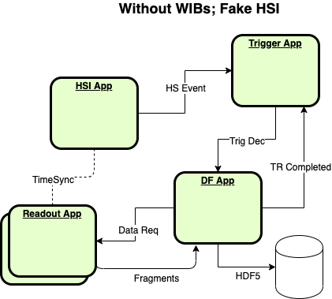
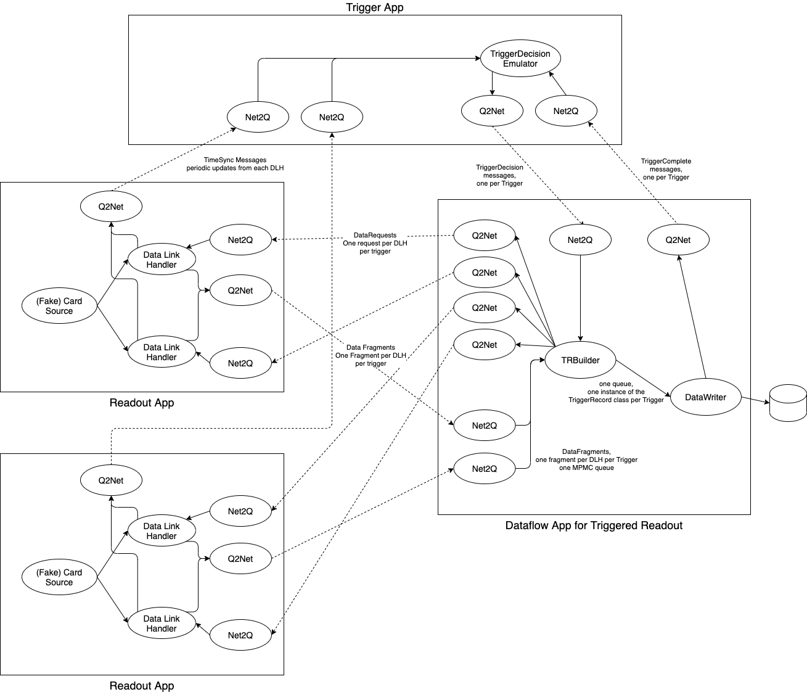

# MiniDAQApp Diagrams
Here is a diagram of a simple system that is supported in dunedaq-v2.8.0.  It uses 'fake' sources to emulate the behavior of the FELIX and HSI electronics.  

*** 

Here is a diagram of a slightly different simple system that also uses emulators instead of real electronics.  This diagrams shows some of the internal details of the processes, especially the DAQModules and queues between them.

-----

_Last git commit to the markdown source of this page:_

_Author: Kurt Biery_

_Date: Fri Aug 27 09:34:38 2021 -0500_

_If you see a problem with the documentation on this page, please file an Issue at [https://github.com/DUNE-DAQ/minidaqapp/issues](https://github.com/DUNE-DAQ/minidaqapp/issues)_

