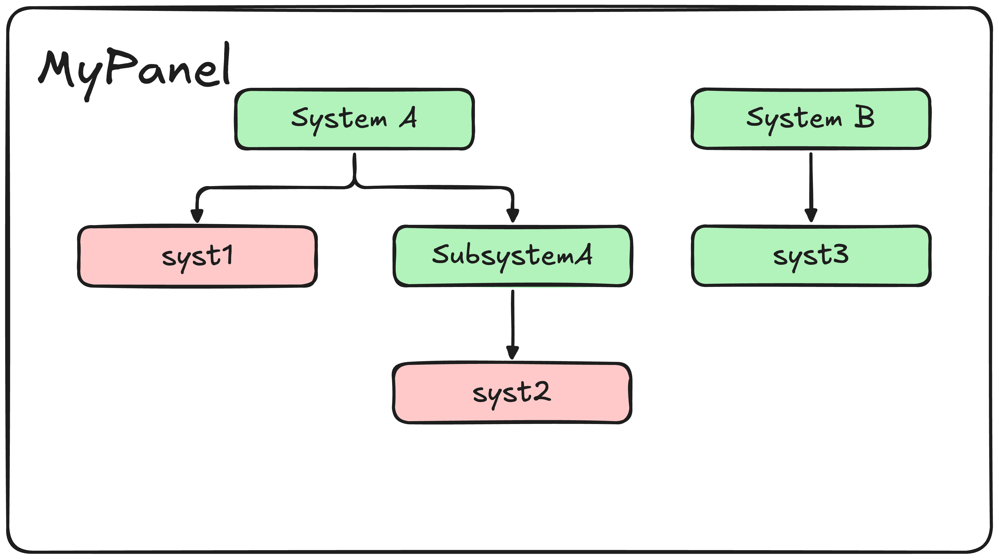

# Developer Guide

This guide walks through the architecture of runconf-ui from the perspective of a developer. For questions about Textual specifically, see the [Textual documentation](https://textual.textualize.io).

---

## Code Structure

`runconf_ui` is split into five module types:

- **`apps`** — full Textual applications (entry points).
- **`interfaces`** — interfaces with DAQ libraries.
- **`screens`** — Textual screens used by the DAQ applications.
- **`utils`** — internal utility functions.
- **`widgets`** — internal Textual widgets.


The codebase is also functionally split in half:

- **The backend** — responsible for core logic: opening configurations and repo management. Exposed to the frontend through a single `RunconfUIBackend` class.
- **The Textual frontend** — thin layer that renders state and forwards user interactions to the backend via Textual's `Message` system.

---

## The Backend

`RunconfUIBackend` is the central controller. It is initialised with a `RunconfContext` dataclass that carries all necessary boot parameters:

```python
@dataclass
class RunconfContext:
    apparatus: str           # e.g. "np02"
    conf_directory: Path     # path to the config repo
    use_local: bool          # local filesystem vs remote git
    config_file_name: str | None   # remote only
    base_url: str | None           # remote only
    ops_url: str | None            # remote only
    output_directory: Path         # where saved configs are written
    log_level: LogLevels           # "INFO" | "DEBUG" | "WARNING"
```


The backend has four main responsibilities, described below.
---

### The Repo Manager

Two repo managers are available, both inheriting from `RepoManagerInterface`:


**`LocalRepoManager`** manages repositories on the local filesystem. It requires the apparatus name and a path to the configuration directory. It uses `get_configs_with_session()` to find all `.data.xml` files in that directory that contain a `Session` DAL.


**`RemoteRepoManager`** manages repositories stored in remote git repositories via `runconftools.ConfPool`. It requires the apparatus name, a local cache directory, the config filename to look for, and the ops and base repository URLs.

Both managers expose the same interface: `get_available_daq_versions()`, `get_daq_sessions()`, `set_daq_version()`, `select_config()`, and `get_runconf_ui_config_path()`. The last method locates the YAML system configuration file at `[conf_directory]/runconf-ui-settings/[apparatus].yml`.

---

### System Configuration

Once a user has selected a repo and session, the paths for the OKS config and YAML system configuration are passed into `SystemConfigReader`. This is the public facade for the system configuration pipeline, which runs in three stages:


**1. `SystemConfig`** reads the YAML file and converts it into typed dataclass skeletons using `YamlToSystemData`. Nothing from the OKS configuration is touched at this stage. The output is a set of `DisableableGroupData` and `AdjustableGroupData` objects.


**2. `ConfigAssembler`** takes those skeletons and a live `Configuration` object, and builds Group trees from them using the system builders (see below). The output is a list of `AssembledGroup` objects.


**3. `AssembledConfig`** is the final output, containing:

- `disableable` — list of `AssembledGroup` objects for the enable/disable panels.
- `adjustable` — list of `AssembledGroup` objects for the adjustable attribute panels.
- `disableable_nodes`, `adjustable_nodes`, `all_nodes` — flat dictionaries mapping node paths to `NodeStatus` objects, used for O(1) lookup by the backend and frontend.

Each `AssembledGroup` contains a list of `AssembledSystem` objects. Each `AssembledSystem` owns a `Group` root node representing that system's state tree.



---

### The Configuration Tree

When a system definition is assembled, `DisableSystemBuilder` or `AdjustableSystemBuilder` converts it into a tree of `Node` objects. There are two node types:


**`Leaf`** wraps a single `Adapter`. It is the only node type that reads from and writes to `conffwk`.


**`Group`** aggregates the state of its children using a strategy function:
- `strategy=all` — AND semantics: the group is enabled iff every voting child is enabled. Used when `subsystem_dependent=False`.
- `strategy=any` — OR semantics: the group is enabled if any voting child is enabled. Used when `subsystem_dependent=True`, and for all intermediate subsystem groups.

#### Child flags

Every child of a `Group` carries two boolean flags:

| `votes` | `propagate` | Meaning |
|---|---|---|
| `True` | `True` | Normal disable child. Influences parent state and receives `set()` calls from the parent. Default. |
| `False` | `True` | Gated by parent and set when parent is set, but does not influence parent state. Used for controlled-but-non-voting components. |
| `False` | `False` | Adjustable child. Fully independent of the enable/disable tree. Never receives `set()` from parent. |

#### Adapters

Leaf nodes wrap one of three `Adapter` subclasses, which provide a uniform `get()`/`set()` interface over the underlying DAL:

| Adapter | Used for |
|---|---|
| `DisableComponent` | `Resource` DAL objects — toggled via `enable_component` / `disable_component` from `confmodel_dal`. Raises `IncompatibleDalException` if the DAL is not a `Resource` subclass. |
| `DisableAttribute` | Named boolean-like attributes on a DAL (e.g. `tp_generation_enabled`). Also checks the DAL's resource-disabled state: if the DAL itself is disabled as a resource, the attribute is considered disabled regardless of its stored value. |
| `AdjustableAttribute` | Any-valued attributes (trigger rates, thresholds, etc.). Reads and writes the attribute value directly without any resource-state logic. |

#### State

State is computed lazily by `compute_state(node, parent)` and never cached on nodes. Call `walk()` again after any `set()` to get fresh values. Three states are possible:

| State | Meaning |
|---|---|
| `ENABLED` | Node is on, its DAL is resource-enabled, and its parent (if any) is on. |
| `DISABLED` | Node is internally off but its parent is on. Renders as an inactive button. |
| `PARENT_DISABLED` | Disabled due to an external condition: the parent group is off, or the DAL is resource-disabled in the session. Takes precedence over the node's own value. Renders as greyed-out and non-interactive. |

`walk(root)` performs a depth-first traversal of the tree, yielding a `NodeStatus` for every node. `NodeStatus` carries the node itself, its computed `State`, and its parent `Group`.

#### Factories

The builders use factory classes to create Leaf and Group nodes from the YAML dataclasses:

| Factory | Creates |
|---|---|
| `ComponentFactory` | `Leaf(DisableComponent)` — one per matching DAL object |
| `AttributeFactory` | `Group(strategy=any)` containing `Leaf(DisableAttribute)` — one leaf per matching DAL in the specified segments |
| `RelationshipFactory` | Same structure as `AttributeFactory`, but first resolves `enabled_state`/`disabled_state` string IDs to DAL objects |
| `AdjustableFactory` | `Leaf(AdjustableAttribute)` — one per matching DAL object |

All factories inherit from `FactoryBase`, which provides `resolve_dals()` for looking up DAL objects by class and ID, and `is_filtered()` for applying `FilterData` exclusions.

---

### The Full Backend Class

`RunconfUIBackend` wraps all of the above and exposes a simple API to the frontend:

| Method | Description |
|---|---|
| `get_daq_versions()` / `get_sessions()` | Forward to the repo manager |
| `set_daq_version()` / `set_daq_session()` | Forward to the repo manager |
| `open_selected_session()` | Load the selected config, assemble the tree, build indices |
| `save_config()` | Commit the in-memory config and write a consolidated copy to disk |
| `toggle(group, node_id)` | Toggle a disableable node, then rebuild all indices |
| `set_value(group, node_id, value)` | Set an adjustable node's value, then rebuild indices |
| `get_disableable_values()` | Return all disableable node statuses grouped by panel |
| `get_adjustable_values()` | Return all adjustable node statuses grouped by group |
| `get_tree_views()` | Return Rich Tree objects for all system map panels |
| `get_config_tree()` | Return a Rich Tree of the full OKS configuration |

After every mutation (`toggle` or `set_value`), `_rebuild_indexes()` is called. This re-walks all system trees, rebuilds the flat node dictionaries, and regenerates the tree views.

> **Note:** The backend class is currently rather large. A refactor is planned for a future release.

---

## The Textual Frontend

The frontend consists of `RunconfUIApp` (the main `App` subclass) and a set of screens and widgets. It is intentionally lightweight — all widgets communicate via Textual's `Message` system rather than holding references to the backend directly.

### Screens

| Screen | Type | Description |
|---|---|---|
| `MainScreen` | Mode screen | Primary screen. Always present as the base layer. |
| `LoadingScreen` | Modal | Shown while a config is being loaded in a worker thread. |
| `QuitScreen` | Modal | Confirmation dialog with Create+Quit, Quit Without Saving, and Cancel options. |
| `CreateScreen` | Modal | Confirmation dialog with Create+Quit and Cancel options. |
| `HelpScreen` | Overlay | Scrollable help text. |
| `ExceptionScreen` | Modal | Displays an error message with OK and Quit options. |

### Widgets

| Widget | Description |
|---|---|
| `FileSelect` | Drop-downs for DAQ version and session, plus the Open button and status text. |
| `EnableDisableTabs` | `DynamicTabbedContent` — one `EnableDisablePanel` tab per disableable group. |
| `EnableDisablePanel` | Scrollable list of toggle buttons, one per node in the group. |
| `AdjustableAttributeTabs` | `DynamicTabbedContent` — one `AdjustableAttributePanel` tab per adjustable group. |
| `AdjustableAttributePanel` | Scrollable list of `AdjustableAttributeContainer` widgets. |
| `RichTreeTabbed` | `DynamicTabbedContent` — one `RichTreePanel` tab per system map view. |
| `ConfigTreePanel` | Scrollable display of the full OKS configuration tree. |
| `OptionsPanel` | Create, Reset, Help, and Quit buttons. |

`DynamicTabbedContent` is an abstract base that wraps a `TabbedContent` and handles full rebuilds (`load()`) and in-place updates (`update()`) separately. Full rebuilds are triggered when a new config is loaded; in-place updates are triggered by node state changes.

### Message Flow


1. A widget emits a message — e.g. a button in `EnableDisablePanel` emits `NodeToggledMessage`.


2. `RunconfUIApp` handles the message and calls the corresponding backend method — e.g. `backend.toggle(group_id, node_id)`.


3. The backend mutates the OKS configuration, rebuilds its node index, and returns.


4. `RunconfUIApp` calls `_refresh_enabled_info()`, which pulls fresh state from the backend and calls `update()` on all relevant widgets.

When a config is first loaded, `load()` is called instead of `update()` to fully reconstruct the tab structure.

### Config loading

Config loading runs in a background worker thread (`@work(thread=True)`) to keep the UI responsive. A `LoadingScreen` modal is pushed before the worker starts and popped when it completes (or fails). On failure, an `ExceptionScreen` is pushed with the exception message.

---

## Utils

The `utils` module contains:

- **Config utilities** (`config_utils.py`) — functions for opening, copying, and consolidating OKS configs; searching for configs with sessions; looking up classes and DALs; setting up the working directory.
- **Logging** (`logging.py`) — a module-level singleton logger (`_LOGGER`) initialised once via `init_logger()` and retrieved anywhere via `get_logger()`. The logger writes to a file and does not emit to the console (to avoid interfering with the TUI).
- **Rich utilities** (`rich_utils.py`) — `ConfigTreeRenderer` for drawing the full OKS config tree, and `draw_node_tree` for drawing individual system state trees, both as Rich `Tree` objects.

-----

<font size="1">
_Last git commit to the markdown source of this page:_


_Author: Henry Wallace_

_Date: Thu Apr 9 12:32:21 2026 +0100_

_If you see a problem with the documentation on this page, please file an Issue at [https://github.com/DUNE-DAQ/runconf-ui/issues](https://github.com/DUNE-DAQ/runconf-ui/issues)_
</font>
