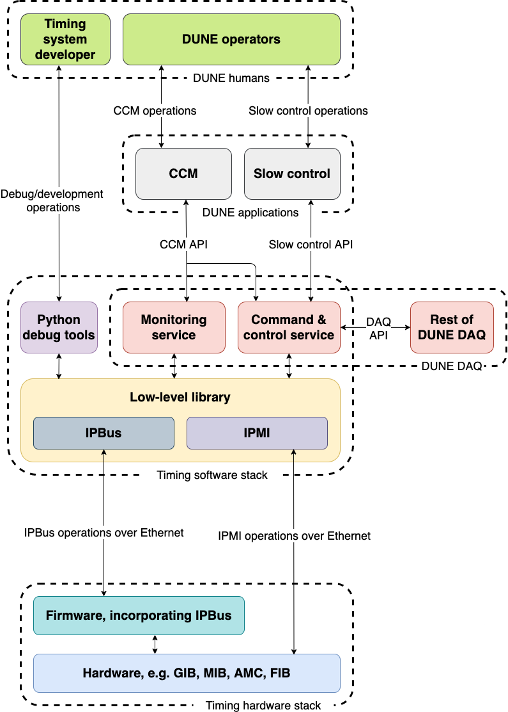
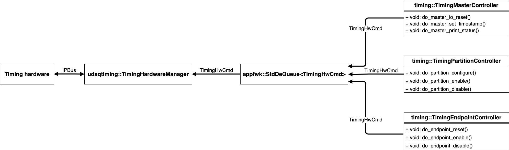

# timinglibs
## Overview
### In a single sentence
`timinglibs` is a repository containing a collection of DUNE DAQ modules, which together form the timing control and monitoring DAQ application.

### In a bit more detail:

The DUNE DAQ modules in `timnglibs` can be split in two groups:

* DAQ mdoules which provide the control, configuration, and monitoring interface to the `HD` timing system

* DAQ modules which provide `HSI` functionality, i.e. emulation and readout 

`timinglibs` also provides a set of python scripts to generate the necessary `json` configuration files to run the aforementioned DUNE DAQ modules.

Each of the different aspects of `timinglibs` are described in more detail in the following sections.

## DUNE DAQ Modules

### Control, configuration, and monitoring
The general principle of the modules providing the timing `CCM` interface is that there is one hardware interface module which handles all interactions between `CCM` and the timing hardware. This hardware interface module receives its low level commands from `controller` modules, which receive higher level commands from `CCM`, and translate them into the low level instructions consumed by the hardware interface. Each `controller` module is responsible for indepdently managing a particular logical entity within the timng system, e.g. `timing master`, `timing partition`, or `timing endpoint`. An illustration of the envisioned timing software stack can be found below.

A diagram of the connections between `timinglibs` DUNE DAQ modules inside of an example timing control application is shown below.

A list of the currently implemented control mdoules, along with their function, can be found below.

#### TimingHardwareManagerPDI

It receives hardware commands from timing `controller` modules, and makes the appropriate calls to `PD-I` timing hardware over `IPBus`. The interface to the timing hardware is provided by the [`timing` package](https://github.com/DUNE-DAQ/timing). It is also responsible for extracting operational monitoring information from timing devices, e.g. `timing master`, `timing HSI`, `timing endpoint`. 

The module currently supports the following timing firmware and hardware combinations.

* Master designs
    * `Boreas` on `TLU`
    * `Boreas` on `FMC`
    * `Overlord` on `TLU`
    * `Overlord` on `FMC`

* Endpoint designs
    * `Endpoint` on `FMC`

#### TimingMasterController

`controller` module providing an interface to `timing master` devices. It receives commands from an external source, e.g. a timing system operator or `CCM`, and translates those commands to timing hardware commands which are then sent to the hardware interface module. Each instance of this module is responsible for managing one particular physical `timing master`. The commands currently supported by the module are:

* master_io_reset

* master_set_timestamp

* master_print_status

#### TimingPartitionController

It receives `timing partition` commands from an external source, e.g. a timing system operator or `CCM`, and translates those commands to timing hardware commands which are then sent to the hardware interface module. Each instance of this module is responsible for managing one particular logical `timing partition`. The commands currently supported by the module are:

* partition_configure

* partition_enable

* partition_disable

* partition_start

* partition_stop

* partition_enable_triggers

* partition_disable_triggers

* partition_print_status

#### TimingEndpointController

It receives `timing endpoint` commands from an external source, e.g. a timing system operator or `CCM`, and translates those commands to timing hardware commands which are then sent to the hardware interface module. The endpoint hardware commands issued by this module are addressed endpoint `0` on the `timing endpint` device. The commands currently supported by the module are:

* endpoint_io_reset

* endpoint_enable

* endpoint_disable

* endpoint_reset

* endpoint_print_status

#### HSIController

A module for controlling the `HD timing` implementation of an HSI. The HSI may or may not be in the same physical device as the `timing master`. The controller current accepts the following timing commands:

* hsi_io_reset

* hsi_endpoint_enable

* hsi_endpoint_disable

* hsi_endpoint_reset

* hsi_reset

* hsi_configure

* hsi_start

* hsi_stop

* hsi_print_status

### HSI readout and emulation

#### HSIReadout

A DUNE DAQ module for reading `HSIEvent` from `HSI` hardware. The module periodically polls the `HSI` firmware, and checks if there are complete events in the buffer. If there is at least one such event, the event is read out, a `dfmessages::HSIEvent` is constructed and sent out on the `HSIEvent` output queue. The interval between polls is configurable via the parameter `readout_period`.

#### FakeHSIEventGenerator

In the absence of real `HSI` hardware, this module can be used to emululate an `HSI`, and act as a source of `HSIEvent`s. The timestamp of the emulated `HSIEvent`s is obtained from timestamp estimates provided by `TimestampEstimator`. The distribution of signals in the `HSIEvent` bitmap along with their rate are configurable via the following parameters.

* `clock_frequency`: Assumed clock frequency in Hz (for current-timestamp estimation); default: `50000000`

* `timestamp_offset`: Offset for HSIEvent timestamps in units of clock ticks. Positive offset increases timestamp estimate; default: `0`

* `event_period`: Period between HSIEvent generation [ns]; default: `1e9`

* `hsi_device_id`: HSI device ID for emulated HSIEvent messages; default: `1`

* `mean_signal_multiplicity`: Mean number of edges expected per signal. Used when signal emulation mode is 1; default: `1`

* `enabled_signals`: Which signals or bit of the 32 bit signal bit map are enabled, i.e. could produce an emulated signal; default: `0`

* `signal_emulation_mode`: Signal bit map emulation mode; default: `0`
    * `0`: enabled signals always on
    * `1`: enabled signals are emulated (independently) according to a Poisson with mean mean_signal_multiplicity; signal map generated with uniform distr. enabled signals only       

## Python configuration generation

The `timinglibs/python/timinglibs/timing_app_confgen.py` script generates a `json` configuration file for instantiation of timing control and monitoring application. The script takes in one argument which is the name of the produced `json` file. The default file name is `timing_app.json`. The script is also able to accept the following command line options:

* `-r` or `--run-number`
   
   Run number parameter for the `start` `rc` command. Not used in any particular way by the current "timing" modules. Default: `333`.

* `-g` or `--gather-interval`
   
   Period (in us) between queries to timing firmware+hardware for "essential" (i.e. level 1) operational monitoring information. Default: `1e6` (us).

* `-d` or `--gather-interval-debug`

   Period (in us) between queries to timing firmware+hardware for "debug" (i.e. level > 1) operational monitoring information. Default: `10e6` (us). 
   
   N.B. This querying involves I2C transactions, setting too short a period may lead to software instability.
    

* `-m` or `--master-device-name`

   Device name of the `timing master` to be monitored and controlled by the timing application. If the string supplied here is non-empty, a `TimingMasterController` named `tmc0`, and a `TimingPartitionController` named `tpc0` will be instantiated. `tpc0` manages `timing partition` `0` on the `timing master` device specified by `-m`. Default: `PROD_MASTER`.

* `--master-clock-file`
   
   Clock configuration file to be used with `master_io_reset` commands issued by `tmc0`. Default: `""` (empty) 

* `--part-trig-mask`,

   Partition trigger mask which is used by the `partition_configure` commands issued by `tpc0`. Default: `0xff`

* `--part-spill-gate',`
   
   Partition spill gate enabled flag which is used by the `partition_configure` commands issued by `tpc0`. Default: `True`

* `--part-rate-control`

   Partition rate control enabled flag which is used by the `partition_configure` commands issued by `tpc0`. Default: `True`

* `-e` or `--endpoint-device-name`

   Device name of an FMC based `timing endpoint` to be monitored and controlled by the timing application. If the string supplied here is non-empty, a `TimingEndpointController` named `tec0` will be instantiated. Default: `""`
    

* `--endpoint-clock-file`
   
   Clock configuration file to be used with `endpoint_io_reset` commands issued by `tec0`. Default: `""` (empty) 

* `--endpoint-address`
   
   Endpoint address to be used by `endpoint_enable` an `endpoint_reset` commands issued by `tec0`. Default: `0`

* `-h` or `--hsi-device-name`, default="")

   Device name of the `HSI` to be monitored and controlled by the timing application. If the string supplied here is non-empty, a `HSIController` named `hsi0` will be instantiated. Default: `""` (empty).

* `--hsi-clock-file`
   
   Clock configuration file to be used with `hsi_io_reset` commands issued by `hsi0`. Default: `""` (empty) 

* `--hsi-endpoint-address`

   Endpoint address to be used with `hsi_endpoint_enable` and `hsi_endpoint_reset` commands to `hsi0`. Default: `0`

* `--hsi-endpoint-partition`
   
   Endpoint partition to be used with `hsi_endpoint_enable` and `hsi_endpoint_reset` commands to `hsi0`. Default: `0`

* `--hsi-re-mask`

   Bit mask controlling whether the HSI triggers on the rising edges of the different incoming signals. Used with `hsi_configure` commands sent by `hsi0`. Default: `0`

* `--hsi-fe-mask`
   
   Bit mask controlling whether the HSI triggers on the failling edges of the different incoming signals. Used with `hsi_configure` commands sent by `hsi0`. Default: `0`

* `--hsi-inv-mask`
   
   Bit mask controlling whether the HSI inverts the edges of the different incoming signals. Used with `hsi_configure` commands sent by `hsi0`. Default: `0`

* `--hsi-source`
   
   Interger controlling the source of signals coming into the `HSI`. Used with `hsi_configure` commands sent by `hsi0`. Default: `0`

    * `0`: signals are taken from the physical interface of the `HSI` device

    * `1`: signals are taken to be bits `39-8` of the `HSI` endpoint timestamp. This is `emulation mode`, a constant rate of `HSI` triggers are generated according to the configured `re`, `fe`, and `inv` masks. 

* `-u` or `--uhal-log-level`

   String to control the uhal logging level. Possible values are: `fatal, error, warning, notice, info, debug`. Default: `notice`.

* `-o` or `--output-path`

   Path of the output `json` file. Default: `.` (current directory).

-----

_Last git commit to the markdown source of this page:_

_Author: Stoyan Trilov_

_Date: Thu May 27 17:21:47 2021 +0100_

_If you see a problem with the documentation on this page, please file an Issue at [https://github.com/DUNE-DAQ/timinglibs/issues](https://github.com/DUNE-DAQ/timinglibs/issues)_

